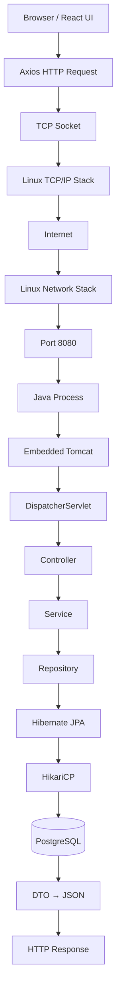
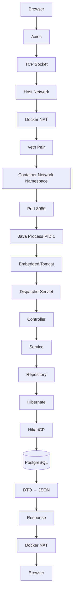
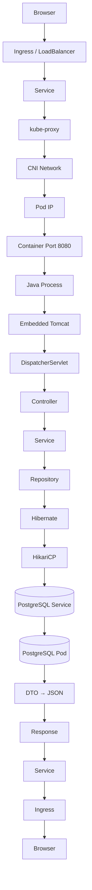
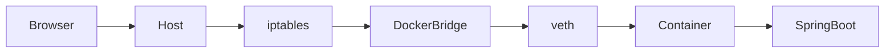
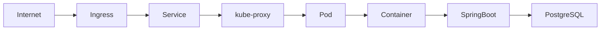

# Complete Journey of One HTTP Request

> This document explains how a request travels through a Spring Boot application running:
>
> - Bare Metal / Virtual Machine
> - Docker Container
> - Kubernetes Pod

---

# Table of Contents

1. Bare Metal / VM
2. Docker
3. Kubernetes
4. Architecture Comparison
5. Docker Networking
6. Kubernetes Networking
7. Key Takeaways
8. Observability
9. Useful Commands

---

# 1. Bare Metal / VM



## Flow

1. Browser sends HTTP request.
2. Linux TCP/IP stack creates TCP connection.
3. Tomcat accepts the connection.
4. DispatcherServlet routes the request.
5. Controller calls Service.
6. Service calls Repository.
7. Hibernate executes SQL.
8. PostgreSQL returns rows.
9. Response is converted to JSON.

---

# 2. Docker



## What Docker Adds

- Container isolation
- Network namespace
- veth pair
- Bridge networking
- Port publishing (NAT)
- Overlay filesystem

---

# 3. Kubernetes



## What Kubernetes Adds

- Ingress
- Service discovery
- kube-proxy
- CNI networking
- Pod abstraction
- Scheduling
- Self-healing
- Rolling updates

---

# 4. Architecture Comparison

| Feature | Bare Metal | Docker | Kubernetes |
|---------|------------|---------|------------|
| Isolation | Process | Container | Pod |
| Networking | Linux | Bridge + NAT | CNI + Service |
| Scaling | Manual | Manual | Automatic |
| Self Healing | No | No | Yes |
| Load Balancing | External | External | Built-in |
| Deployment | Manual | Docker | Declarative YAML |

---

# 5. Docker Networking



---

# 6. Kubernetes Networking



---

# 7. Key Takeaways

- Application code remains unchanged across environments.
- Docker provides portability and isolation.
- Kubernetes provides orchestration.
- Services provide stable networking.
- Pods provide execution environments.
- Ingress exposes applications externally.

---

# 8. Observability

## Application

- Micrometer
- Prometheus
- Logs
- Traces

## System

- CPU
- Memory
- Disk
- Network

## Database

- pg_stat_activity
- Slow queries
- Locks

---

# 9. Useful Commands

## Linux

```bash
ps -ef
top
ss -ltnp
lsof -i
```

## Docker

```bash
docker ps
docker logs <container>
docker exec -it <container> bash
docker inspect <container>
```

## Kubernetes

```bash
kubectl get pods -o wide
kubectl describe pod <pod>
kubectl logs <pod>
kubectl exec -it <pod> -- bash
kubectl get svc
kubectl get ingress
```

---

# Summary

Bare Metal focuses on operating system processes.

Docker adds container isolation, networking, and portability.

Kubernetes orchestrates containers using Pods, Services, Ingress, scheduling, and self-healing while keeping the application code unchanged.
