# Complete Flow of One HTTP Request — End-to-End Deep Dive

> GitHub-native version of the architecture poster using Mermaid diagrams and Markdown.

## Table of Contents

1. Architecture Overview
2. React UI & Browser
3. HTTP Protocol
4. Internet & Network Path
5. Linux Network Stack
6. Socket & Port
7. Linux Process
8. JVM Internals
9. Embedded Tomcat
10. Spring MVC
11. Hibernate (JPA)
12. JDBC & HikariCP
13. PostgreSQL Internals
14. Response & JSON
15. Docker Deep Dive
16. Kubernetes Architecture
17. Kubernetes Request Flow
18. Pod Internals
19. Load Testing & Observability
20. Bare Metal vs Docker vs Kubernetes

## Deep-Dive to Devops-Notes Mapping

| Deep Dive Section | Devops-Notes Mapping |
|---|---|
| 1. Architecture Overview | [01-System-Overview](../Devops-Notes/01-Architecture/01-System-Overview.md), [02-Complete-Request-Journey](../Devops-Notes/01-Architecture/02-Complete-Request-Journey.md), [04-Layered-Architecture](../Devops-Notes/01-Architecture/04-Layered-Architecture.md), [05-Sequence-Diagram](../Devops-Notes/01-Architecture/05-Sequence-Diagram.md) |
| 2. React UI & Browser | [02-MVC](../Devops-Notes/06-SpringBoot/02-MVC.md), [04-Controller](../Devops-Notes/06-SpringBoot/04-Controller.md), [07-DTO](../Devops-Notes/06-SpringBoot/07-DTO.md) |
| 3. HTTP Protocol | [04-HTTP-Request](../Devops-Notes/02-Network/04-HTTP-Request.md), [05-HTTPS-TLS](../Devops-Notes/13-Security/05-HTTPS-TLS.md) |
| 4. Internet & Network Path | [05-DNS](../Devops-Notes/02-Network/05-DNS.md), [06-IP-Routing](../Devops-Notes/02-Network/06-IP-Routing.md), [02-TCP-IP](../Devops-Notes/02-Network/02-TCP-IP.md), [03-TCP-Handshake](../Devops-Notes/02-Network/03-TCP-Handshake.md) |
| 5. Linux Network Stack | [09-Linux-Network-Stack](../Devops-Notes/02-Network/09-Linux-Network-Stack.md), [01-Linux-Process](../Devops-Notes/03-Linux/01-Linux-Process.md), [06-File-Descriptors](../Devops-Notes/03-Linux/06-File-Descriptors.md) |
| 6. Socket & Port | [07-Socket](../Devops-Notes/02-Network/07-Socket.md), [08-Port](../Devops-Notes/02-Network/08-Port.md), [07-Sockets](../Devops-Notes/03-Linux/07-Sockets.md), [06-File-Descriptors](../Devops-Notes/03-Linux/06-File-Descriptors.md) |
| 7. Linux Process | [01-Linux-Process](../Devops-Notes/03-Linux/01-Linux-Process.md), [02-Linux-Thread](../Devops-Notes/03-Linux/02-Linux-Thread.md), [04-Virtual-Memory](../Devops-Notes/03-Linux/04-Virtual-Memory.md), [05-Heap-vs-Stack](../Devops-Notes/03-Linux/05-Heap-vs-Stack.md), [10-proc-filesystem](../Devops-Notes/03-Linux/10-proc-filesystem.md) |
| 8. JVM Internals | [01-JVM-Architecture](../Devops-Notes/04-JVM/01-JVM-Architecture.md), [03-Heap](../Devops-Notes/04-JVM/03-Heap.md), [04-Stack](../Devops-Notes/04-JVM/04-Stack.md), [05-Metaspace](../Devops-Notes/04-JVM/05-Metaspace.md), [06-Garbage-Collection](../Devops-Notes/04-JVM/06-Garbage-Collection.md), [08-JVM-Threads](../Devops-Notes/04-JVM/08-JVM-Threads.md), [09-JVM-Memory](../Devops-Notes/04-JVM/09-JVM-Memory.md) |
| 9. Embedded Tomcat | [01-Tomcat-Architecture](../Devops-Notes/05-Tomcat/01-Tomcat-Architecture.md), [02-NIO-Connector](../Devops-Notes/05-Tomcat/02-NIO-Connector.md), [03-Acceptor-Thread](../Devops-Notes/05-Tomcat/03-Acceptor-Thread.md), [04-Poller-Thread](../Devops-Notes/05-Tomcat/04-Poller-Thread.md), [05-Worker-Thread](../Devops-Notes/05-Tomcat/05-Worker-Thread.md), [06-ThreadPool](../Devops-Notes/05-Tomcat/06-ThreadPool.md) |
| 10. Spring MVC | [01-SpringBoot-Architecture](../Devops-Notes/06-SpringBoot/01-SpringBoot-Architecture.md), [02-MVC](../Devops-Notes/06-SpringBoot/02-MVC.md), [03-DispatcherServlet](../Devops-Notes/06-SpringBoot/03-DispatcherServlet.md), [04-Controller](../Devops-Notes/06-SpringBoot/04-Controller.md), [05-Service](../Devops-Notes/06-SpringBoot/05-Service.md), [06-Repository](../Devops-Notes/06-SpringBoot/06-Repository.md), [10-Exception-Handling](../Devops-Notes/06-SpringBoot/10-Exception-Handling.md) |
| 11. Hibernate (JPA) | [01-Entity](../Devops-Notes/07-Hibernate/01-Entity.md), [02-Persistence-Context](../Devops-Notes/07-Hibernate/02-Persistence-Context.md), [03-Entity-Lifecycle](../Devops-Notes/07-Hibernate/03-Entity-Lifecycle.md), [04-Dirty-Checking](../Devops-Notes/07-Hibernate/04-Dirty-Checking.md), [05-SQL-Generation](../Devops-Notes/07-Hibernate/05-SQL-Generation.md), [06-Lazy-vs-Eager](../Devops-Notes/07-Hibernate/06-Lazy-vs-Eager.md), [07-Transactions](../Devops-Notes/07-Hibernate/07-Transactions.md) |
| 12. JDBC & HikariCP | [05-ConnectionPool](../Devops-Notes/12-Performance/05-ConnectionPool.md), [07-Transactions](../Devops-Notes/07-Hibernate/07-Transactions.md), [02-Connection](../Devops-Notes/08-PostgreSQL/02-Connection.md) |
| 13. PostgreSQL Internals | [01-Architecture](../Devops-Notes/08-PostgreSQL/01-Architecture.md), [03-Parser](../Devops-Notes/08-PostgreSQL/03-Parser.md), [04-Planner](../Devops-Notes/08-PostgreSQL/04-Planner.md), [05-Executor](../Devops-Notes/08-PostgreSQL/05-Executor.md), [06-Indexes](../Devops-Notes/08-PostgreSQL/06-Indexes.md), [07-Shared-Buffers](../Devops-Notes/08-PostgreSQL/07-Shared-Buffers.md), [08-WAL](../Devops-Notes/08-PostgreSQL/08-WAL.md), [09-VACUUM](../Devops-Notes/08-PostgreSQL/09-VACUUM.md), [10-EXPLAIN](../Devops-Notes/08-PostgreSQL/10-EXPLAIN.md) |
| 14. Response & JSON | [03-Response-Journey](../Devops-Notes/01-Architecture/03-Response-Journey.md), [07-DTO](../Devops-Notes/06-SpringBoot/07-DTO.md), [10-Exception-Handling](../Devops-Notes/06-SpringBoot/10-Exception-Handling.md) |
| 15. Docker Deep Dive | [01-Docker-Architecture](../Devops-Notes/09-Docker/01-Docker-Architecture.md), [03-Container](../Devops-Notes/09-Docker/03-Container.md), [04-Namespaces](../Devops-Notes/09-Docker/04-Namespaces.md), [05-cgroups](../Devops-Notes/09-Docker/05-cgroups.md), [06-OverlayFS](../Devops-Notes/09-Docker/06-OverlayFS.md), [07-Bridge-Network](../Devops-Notes/09-Docker/07-Bridge-Network.md), [08-veth](../Devops-Notes/09-Docker/08-veth.md), [09-Port-Mapping](../Devops-Notes/09-Docker/09-Port-Mapping.md) |
| 16. Kubernetes Architecture | [01-Kubernetes-Architecture](../Devops-Notes/10-Kubernetes/01-Kubernetes-Architecture.md), [02-API-Server](../Devops-Notes/10-Kubernetes/02-API-Server.md), [03-etcd](../Devops-Notes/10-Kubernetes/03-etcd.md), [04-Scheduler](../Devops-Notes/10-Kubernetes/04-Scheduler.md), [05-ControllerManager](../Devops-Notes/10-Kubernetes/05-ControllerManager.md), [06-Kubelet](../Devops-Notes/10-Kubernetes/06-Kubelet.md), [07-ContainerRuntime](../Devops-Notes/10-Kubernetes/07-ContainerRuntime.md), [08-Pod](../Devops-Notes/10-Kubernetes/08-Pod.md) |
| 17. Kubernetes Request Flow | [12-Ingress](../Devops-Notes/10-Kubernetes/12-Ingress.md), [11-Service](../Devops-Notes/10-Kubernetes/11-Service.md), [13-kube-proxy](../Devops-Notes/10-Kubernetes/13-kube-proxy.md), [14-CNI](../Devops-Notes/10-Kubernetes/14-CNI.md) |
| 18. Pod Internals | [08-Pod](../Devops-Notes/10-Kubernetes/08-Pod.md), [06-Kubelet](../Devops-Notes/10-Kubernetes/06-Kubelet.md), [07-ContainerRuntime](../Devops-Notes/10-Kubernetes/07-ContainerRuntime.md) |
| 19. Load Testing & Observability | [01-ApacheBench](../Devops-Notes/12-Performance/01-ApacheBench.md), [02-LoadTesting](../Devops-Notes/12-Performance/02-LoadTesting.md), [07-Observations](../Devops-Notes/12-Performance/07-Observations.md), [11-Complete-Debugging-Workflow](../Devops-Notes/11-Observability/11-Complete-Debugging-Workflow.md), [09-tcpdump](../Devops-Notes/11-Observability/09-tcpdump.md), [10-Wireshock](../Devops-Notes/11-Observability/10-Wireshock.md), [03-jstack](../Devops-Notes/11-Observability/03-jstack.md), [04-jcmd](../Devops-Notes/11-Observability/04-jcmd.md), [05-jmap](../Devops-Notes/11-Observability/05-jmap.md) |
| 20. Bare Metal vs Docker vs Kubernetes | [01-Linux-Process](../Devops-Notes/03-Linux/01-Linux-Process.md), [03-Container](../Devops-Notes/09-Docker/03-Container.md), [01-Kubernetes-Architecture](../Devops-Notes/10-Kubernetes/01-Kubernetes-Architecture.md), [15-HPA](../Devops-Notes/10-Kubernetes/15-HPA.md) |

---

# 1. Architecture Overview

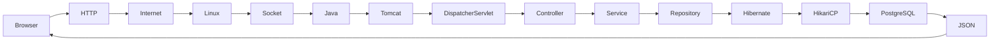

## Summary

- Browser issues HTTP request.
- Linux TCP/IP receives packets.
- Tomcat accepts the socket.
- Spring MVC processes the request.
- Hibernate executes SQL.
- PostgreSQL returns rows.
- Jackson serializes JSON.
- Response travels back to the browser.

---

# 2. React UI & Browser

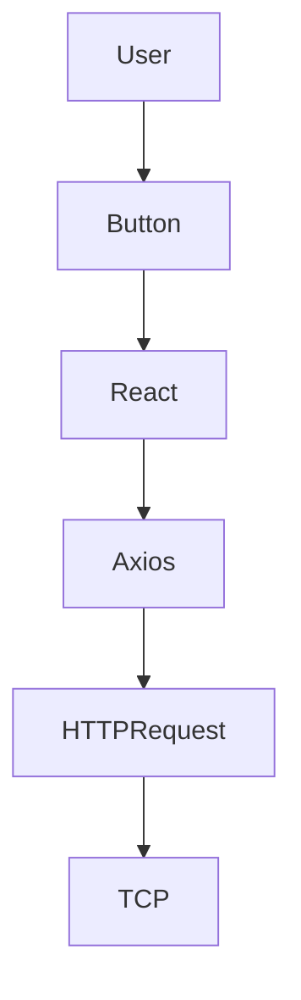

Topics:
- React event handling
- Axios
- Promise lifecycle
- Browser cache
- CORS
- Cookies
- DevTools

---

# 3. HTTP Protocol


Topics:
- Methods
- Headers
- Status Codes
- Keep Alive
- Compression
- HTTP/1.1 vs HTTP/2

---

# 4. Internet & Network Path

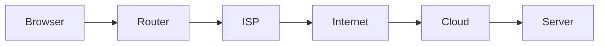

Topics:
- DNS
- Routing
- Public IP
- NAT
- TCP

---

# 5. Linux Network Stack

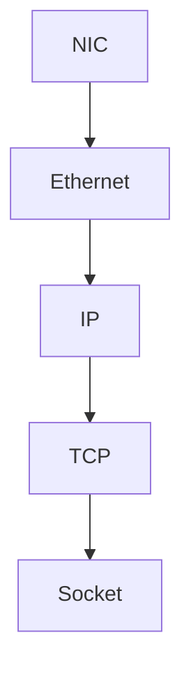

Topics:
- Kernel
- NIC
- Buffers
- Checksums
- TCP receive queue

---

# 6. Socket & Port

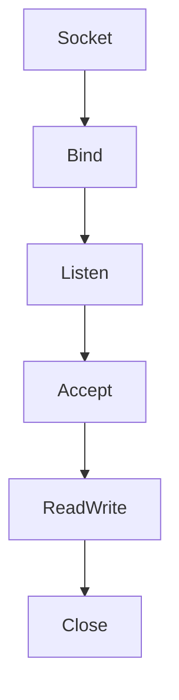

Useful commands:

```bash
ss -ltnp
lsof -i
netstat -tulnp
```

---

# 7. Linux Process

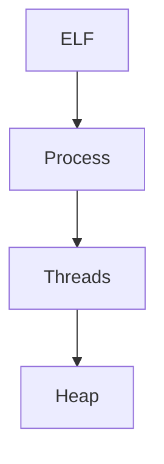

Topics:
- PID
- Memory layout
- Threads
- File descriptors

---

# 8. JVM Internals

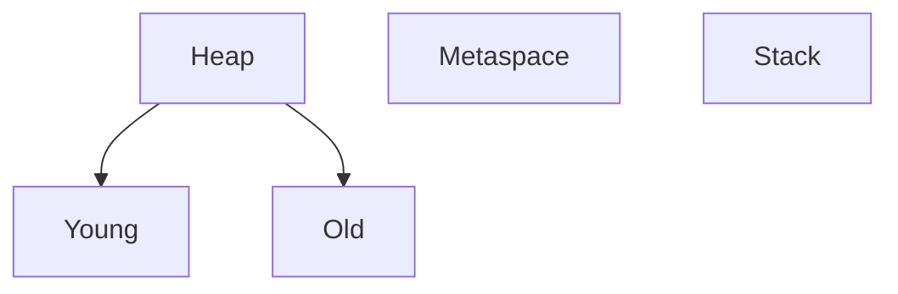

---

# 9. Embedded Tomcat

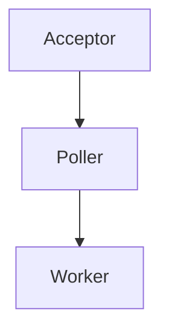

---

# 10. Spring MVC

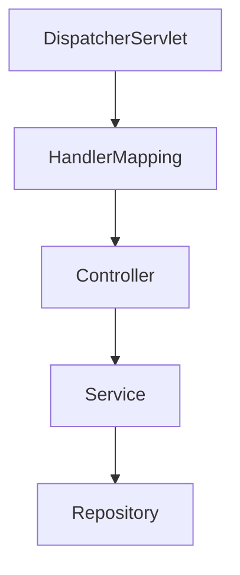

---

# 11. Hibernate

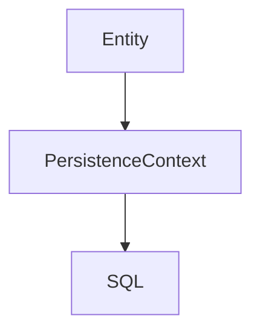

---

# 12. JDBC & HikariCP

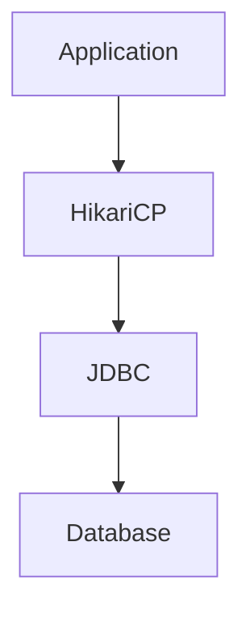

---

# 13. PostgreSQL Internals

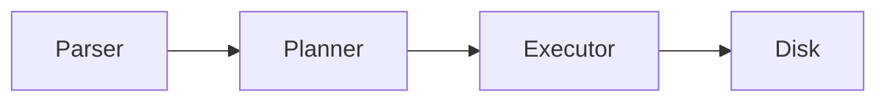

---

# 14. Response & JSON

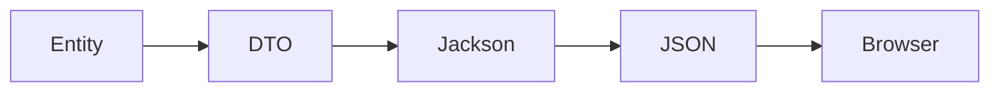

---

# 15. Docker Deep Dive

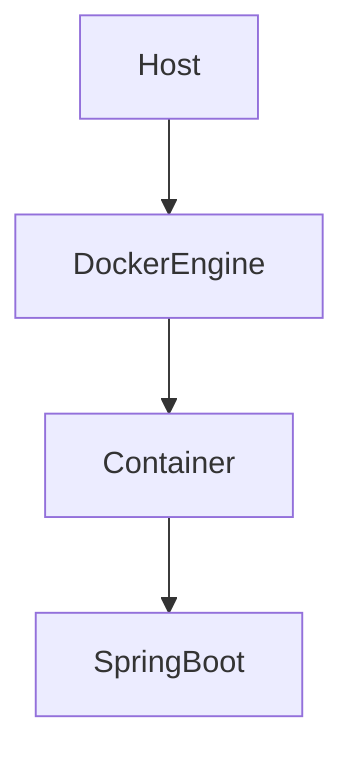

Topics:
- Namespaces
- cgroups
- OverlayFS
- Bridge
- veth
- iptables

---

# 16. Kubernetes Architecture

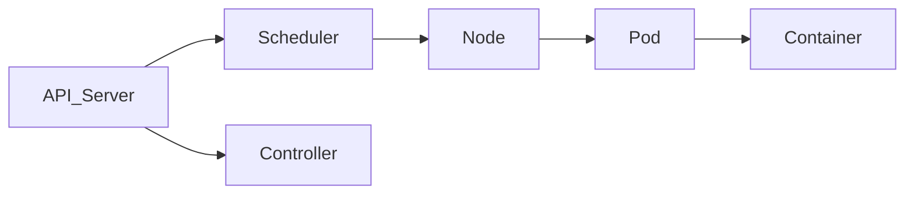

---

# 17. Kubernetes Request Flow


---

# 18. Pod Internals

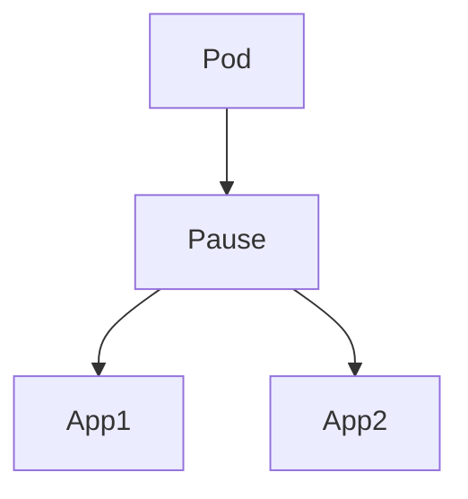

---

# 19. Load Testing & Observability

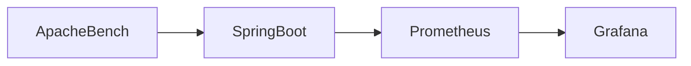

Observe:
- CPU
- Memory
- Network
- Disk
- JVM
- PostgreSQL

---

# 20. Bare Metal vs Docker vs Kubernetes

| Feature | Bare Metal | Docker | Kubernetes |
|---|---|---|---|
| Isolation | Process | Container | Pod |
| Networking | Host | Bridge | CNI |
| Scaling | Manual | Manual | Auto |
| Self Healing | No | No | Yes |
| Scheduling | No | No | Yes |
| Load Balancing | External | External | Built-in |

---

# Useful Commands

## Linux

```bash
ps -ef
top
vmstat
iostat
ss -ltnp
```

## Docker

```bash
docker ps
docker logs
docker exec -it
docker inspect
```

## Kubernetes

```bash
kubectl get pods -o wide
kubectl describe pod
kubectl logs
kubectl exec -it
kubectl get svc
kubectl get ingress
```

---
