# Complete Flow of One HTTP Request — End-to-End Deep Dive

> GitHub-native version of the architecture poster using Mermaid diagrams and Markdown.

## Table of Contents

1. Architecture Overview
2. React UI & Browser
3. HTTP Protocol
4. Internet & Network Path
5. Linux Network Stack
6. Socket & Port
7. Linux Process
8. JVM Internals
9. Embedded Tomcat
10. Spring MVC
11. Hibernate (JPA)
12. JDBC & HikariCP
13. PostgreSQL Internals
14. Response & JSON
15. Docker Deep Dive
16. Kubernetes Architecture
17. Kubernetes Request Flow
18. Pod Internals
19. Load Testing & Observability
20. Bare Metal vs Docker vs Kubernetes

---

# 1. Architecture Overview

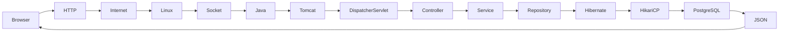

## Summary

- Browser issues HTTP request.
- Linux TCP/IP receives packets.
- Tomcat accepts the socket.
- Spring MVC processes the request.
- Hibernate executes SQL.
- PostgreSQL returns rows.
- Jackson serializes JSON.
- Response travels back to the browser.

---

# 2. React UI & Browser

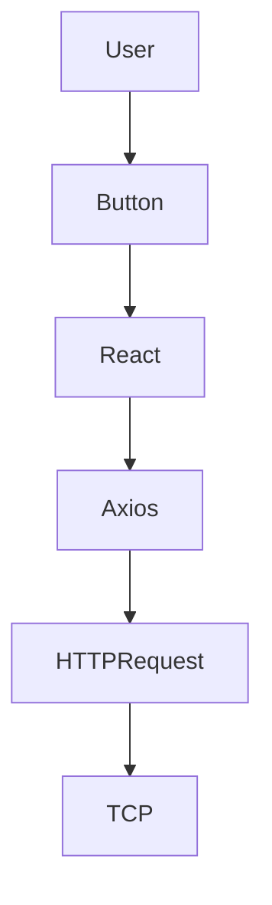

Topics:
- React event handling
- Axios
- Promise lifecycle
- Browser cache
- CORS
- Cookies
- DevTools

---

# 3. HTTP Protocol

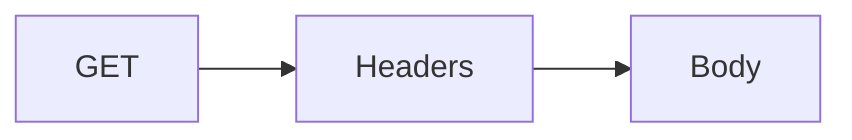

Topics:
- Methods
- Headers
- Status Codes
- Keep Alive
- Compression
- HTTP/1.1 vs HTTP/2

---

# 4. Internet & Network Path

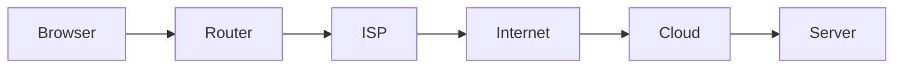

Topics:
- DNS
- Routing
- Public IP
- NAT
- TCP

---

# 5. Linux Network Stack

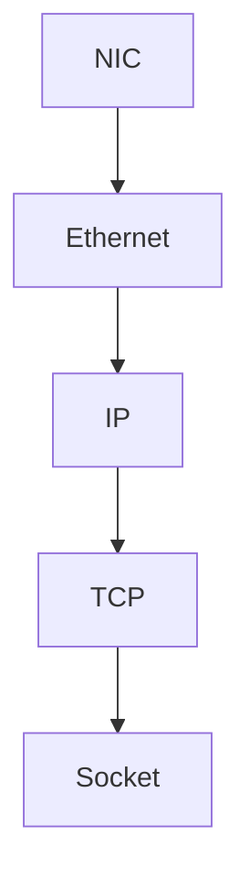

Topics:
- Kernel
- NIC
- Buffers
- Checksums
- TCP receive queue

---

# 6. Socket & Port

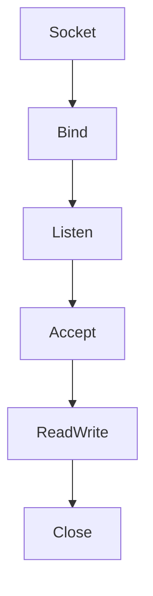

Useful commands:

```bash
ss -ltnp
lsof -i
netstat -tulnp
```

---

# 7. Linux Process

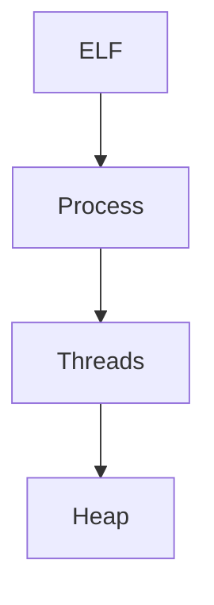

Topics:
- PID
- Memory layout
- Threads
- File descriptors

---

# 8. JVM Internals

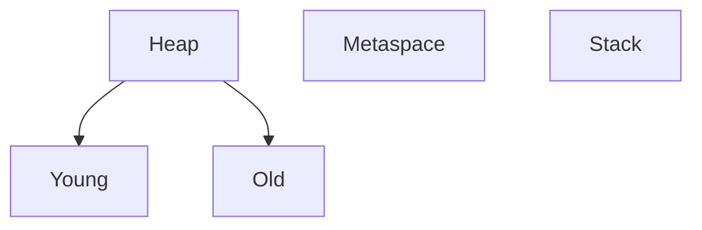

---

# 9. Embedded Tomcat

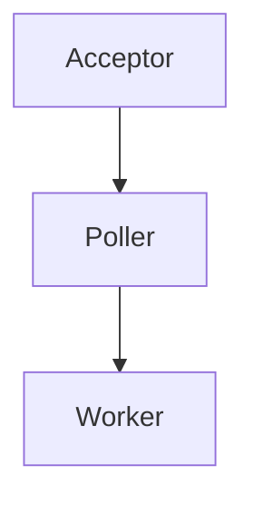

---

# 10. Spring MVC

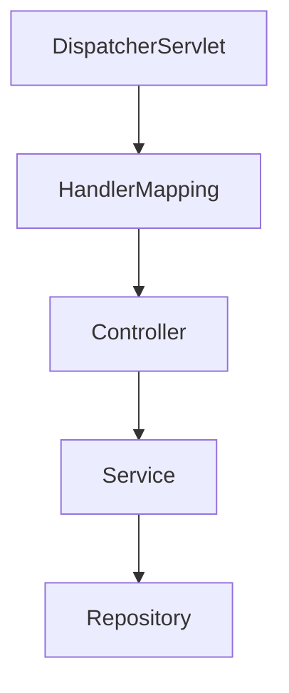

---

# 11. Hibernate

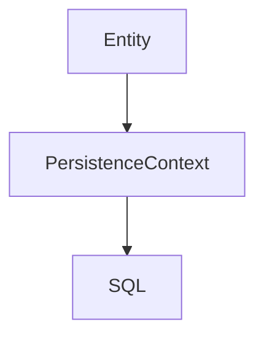

---

# 12. JDBC & HikariCP

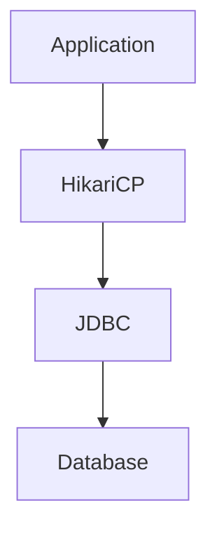

---

# 13. PostgreSQL Internals

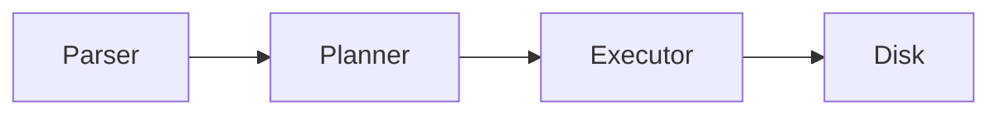

---

# 14. Response & JSON

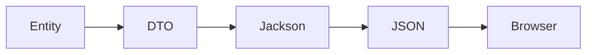

---

# 15. Docker Deep Dive

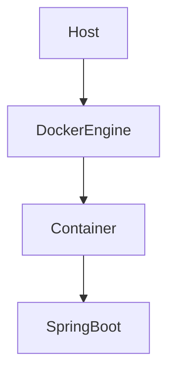

Topics:
- Namespaces
- cgroups
- OverlayFS
- Bridge
- veth
- iptables

---

# 16. Kubernetes Architecture

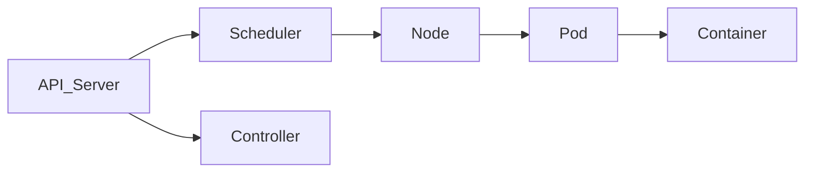

---

# 17. Kubernetes Request Flow

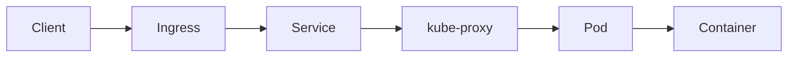

---

# 18. Pod Internals

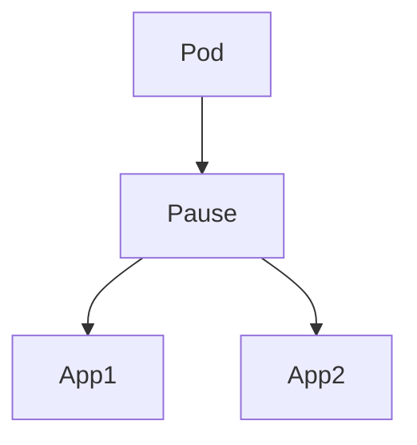

---

# 19. Load Testing & Observability

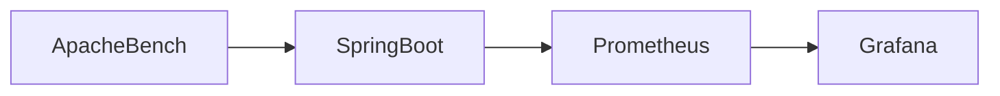

Observe:
- CPU
- Memory
- Network
- Disk
- JVM
- PostgreSQL

---

# 20. Bare Metal vs Docker vs Kubernetes

| Feature | Bare Metal | Docker | Kubernetes |
|---|---|---|---|
| Isolation | Process | Container | Pod |
| Networking | Host | Bridge | CNI |
| Scaling | Manual | Manual | Auto |
| Self Healing | No | No | Yes |
| Scheduling | No | No | Yes |
| Load Balancing | External | External | Built-in |

---

# Useful Commands

## Linux

```bash
ps -ef
top
vmstat
iostat
ss -ltnp
```

## Docker

```bash
docker ps
docker logs
docker exec -it
docker inspect
```

## Kubernetes

```bash
kubectl get pods -o wide
kubectl describe pod
kubectl logs
kubectl exec -it
kubectl get svc
kubectl get ingress
```

---
