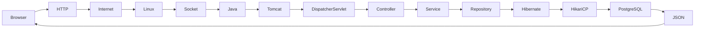

# 📘 Chapter 1 — System Overview (Part 1)

## 🎯 Chapter Goal

Welcome to the **Student Results API Engineering Handbook**.

This guide is **not just about building a Spring Boot application**.

The goal is to understand **everything that happens when a user clicks the "Get Result" button**, from the browser to the operating system, the JVM, PostgreSQL, Docker, and Kubernetes.

By the end of this handbook, you should be able to explain:

* 🌐 How browsers send HTTP requests.
* 🔌 What a TCP socket is.
* 🚪 Why a server listens on port 8080.
* 🐧 How Linux delivers packets to a process.
* ☕ How the JVM executes Java code.
* 🍃 How Spring Boot processes requests.
* 🐘 How PostgreSQL executes SQL.
* 🐳 How Docker runs the application.
* ☸️ How Kubernetes schedules and exposes the application.

Rather than memorizing concepts independently, you'll see how they connect together in a complete system.

---

## Mermaid Snapshot (From deep-dive)



# 🎯 Learning Objectives

After completing this chapter, you should understand:

* ✅ The purpose of the Student Results API.
* ✅ The major components of the system.
* ✅ How those components communicate.
* ✅ The technologies used at each layer.
* ✅ The difference between application architecture and deployment architecture.
* ✅ How this application evolves from running directly on Linux to Docker and Kubernetes.

---

# 🏗️ High-Level System Architecture

```text
                              STUDENT RESULTS SYSTEM

                                     👨‍🎓 Student
                                         │
                                         │ Types Roll Number
                                         ▼
                           ┌────────────────────────────┐
                           │ 🌐 React Web Application   │
                           │ Material UI + Axios        │
                           └─────────────┬──────────────┘
                                         │
                                         │ HTTP GET
                                         ▼
                           ┌────────────────────────────┐
                           │ ☕ Spring Boot API         │
                           │ Embedded Tomcat           │
                           └─────────────┬──────────────┘
                                         │
                                         │ Spring Data JPA
                                         ▼
                           ┌────────────────────────────┐
                           │ 🐘 PostgreSQL Database     │
                           └────────────────────────────┘
```

This architecture contains **three logical tiers**:

### 🌐 Presentation Layer

Responsible for interacting with the user.

Technology:

* React
* Material UI
* Axios

Responsibilities:

* Collect roll number.
* Validate user input.
* Send HTTP request.
* Display the result.

---

### ☕ Application Layer

Responsible for business logic.

Technology:

* Spring Boot
* Spring MVC
* Spring Data JPA
* Hibernate
* Embedded Tomcat

Responsibilities:

* Receive HTTP requests.
* Validate input.
* Fetch student information.
* Calculate total marks.
* Calculate percentage.
* Determine PASS/FAIL.
* Generate JSON response.

---

### 🐘 Data Layer

Responsible for storing information.

Technology:

* PostgreSQL

Responsibilities:

* Store student records.
* Store subject marks.
* Execute SQL queries efficiently.
* Use indexes for fast lookups.

---

# 🧩 Why This Architecture?

Applications are divided into layers because each layer has **one primary responsibility**.

Instead of writing everything in one Java class, responsibilities are separated.

```text
Browser
   │
   ▼
Controller
   │
   ▼
Service
   │
   ▼
Repository
   │
   ▼
Database
```

Benefits include:

* ✅ Easier testing
* ✅ Easier maintenance
* ✅ Better readability
* ✅ Reusable business logic
* ✅ Separation of concerns

---

# 🛠️ Technology Stack

| Layer              | Technology      | Purpose                    |
| ------------------ | --------------- | -------------------------- |
| 🌐 Frontend        | React           | User Interface             |
| 🎨 UI              | Material UI     | Components                 |
| 📡 HTTP Client     | Axios           | API Communication          |
| ☕ Backend          | Spring Boot     | Business Logic             |
| 🌱 Framework       | Spring MVC      | REST APIs                  |
| 🗄️ ORM            | Hibernate       | Object–Relational Mapping  |
| 🔗 Repository      | Spring Data JPA | Database Access            |
| 🐘 Database        | PostgreSQL      | Persistent Storage         |
| 💧 Connection Pool | HikariCP        | Efficient JDBC Connections |
| 🌍 Web Server      | Embedded Tomcat | HTTP Server                |
| 🐳 Container       | Docker          | Application Packaging      |
| ☸️ Orchestration   | Kubernetes      | Container Management       |

---

# 📦 What Does Each Technology Do?

## 🌐 React

React builds the graphical user interface.

Responsibilities:

* Render HTML.
* Manage application state.
* Send API requests.
* Update the screen after receiving JSON.

Without React:

There would be no user interface.

---

## 📡 Axios

Axios is an HTTP client.

Responsibilities:

* Create HTTP requests.
* Add headers.
* Send requests.
* Receive JSON.
* Handle errors.

Without Axios:

The browser would have no simple way to communicate with the backend.

---

## ☕ Spring Boot

Spring Boot is the backend framework.

Responsibilities:

* Start Tomcat.
* Configure Spring automatically.
* Create REST APIs.
* Manage Beans.
* Handle dependency injection.

Without Spring Boot:

You would need to manually configure the web server, dependency injection, routing, and application startup.

---

## 🐘 PostgreSQL

PostgreSQL stores application data.

Responsibilities:

* Store students.
* Store marks.
* Execute SQL queries.
* Use indexes for performance.
* Ensure data consistency.

Without PostgreSQL:

Student information would not persist across application restarts.

---

# 💡 Key Takeaways

* The Student Results API follows a classic three-tier architecture.
* Each layer has a single responsibility.
* React handles presentation.
* Spring Boot handles business logic.
* PostgreSQL handles persistence.
* Separating responsibilities makes the system easier to maintain, test, and extend.

---

# 📘 Chapter 1 — System Overview (Part 2)

> 📂 This section explains **how the Student Results API project is organized**, why each folder exists, and how the application is structured internally.

---

# 📂 Project Folder Structure

```text
student-results-api
│
├── 📄 pom.xml
├── 📄 Dockerfile
├── 📄 docker-compose.yml
│
├── 📂 src
│   │
│   ├── 📂 main
│   │   │
│   │   ├── 📂 java
│   │   │    │
│   │   │    └── com.example.student
│   │   │
│   │   │        ├── 🚀 StudentResultsApiApplication.java
│   │   │        │
│   │   │        ├── 📂 controller
│   │   │        │      └── StudentController.java
│   │   │        │
│   │   │        ├── 📂 service
│   │   │        │      └── StudentService.java
│   │   │        │
│   │   │        ├── 📂 repository
│   │   │        │      ├── StudentRepository.java
│   │   │        │      └── StudentMarksRepository.java
│   │   │        │
│   │   │        ├── 📂 entity
│   │   │        │      ├── Student.java
│   │   │        │      └── StudentMark.java
│   │   │        │
│   │   │        ├── 📂 dto
│   │   │        │      ├── StudentResponse.java
│   │   │        │      ├── SubjectResponse.java
│   │   │        │      └── ErrorResponse.java
│   │   │        │
│   │   │        ├── 📂 exception
│   │   │        │      ├── StudentNotFoundException.java
│   │   │        │      └── GlobalExceptionHandler.java
│   │   │        │
│   │   │        └── 📂 config
│   │   │               └── CorsConfig.java
│   │   │
│   │   └── 📂 resources
│   │
│   │        ├── application.properties
│   │        └── init.sql
│   │
│   └── 📂 test
│
├── 📂 k8s
│
├── 📂 load-test
│
└── 📂 docs
```

---

# 🎯 Why Is the Project Split into Packages?

Spring Boot follows a layered architecture.

Each package has **one responsibility**.

This follows the **Single Responsibility Principle (SRP)**.

Instead of writing 5,000 lines in one file, every component performs one job.

---

# 🚀 StudentResultsApiApplication

```text
StudentResultsApiApplication

↓

@SpringBootApplication

↓

SpringApplication.run()

↓

Starts JVM

↓

Creates Spring Context

↓

Starts Embedded Tomcat

↓

Listens on Port 8080
```

This is the **entry point** of the application.

Without this file, nothing starts.

---

# 🎯 Controller Package

```text
Browser

↓

GET /students/1051110244

↓

StudentController
```

Responsibilities

* Receive HTTP request
* Read URL
* Read Path Variable
* Validate request
* Call Service
* Return JSON

Think of the Controller as the **Reception Desk**.

It receives visitors and forwards them to the correct department.

It should **NOT**

❌ Calculate Percentage

❌ Write SQL

❌ Access Database

---

# 🧠 Service Package

```text
StudentController

↓

StudentService
```

Responsibilities

* Business Logic
* Calculate Total
* Calculate Percentage
* Calculate Grade
* Determine PASS/FAIL

Think of Service as the **Brain**.

Every decision is taken here.

The Controller only delegates work.

---

# 🗄️ Repository Package

```text
StudentService

↓

StudentRepository

↓

Hibernate

↓

SQL
```

Responsibilities

* Read database
* Save database
* Delete records
* Update records

Repository never knows

❌ HTTP

❌ JSON

❌ Browser

It only knows

✔ Database

---

# 🐘 Entity Package

Entities represent **Database Tables**

Example

```text
students table

↓

Student.java
```

```text
student_marks table

↓

StudentMark.java
```

Each Entity maps one row.

Example

```text
Student

Roll Number

First Name

Last Name
```

↓

One Java Object

---

# 📦 DTO Package

DTO means

```text
Data Transfer Object
```

Purpose

Never expose Entity directly.

Instead

```text
Database Entity

↓

DTO

↓

JSON
```

Advantages

✅ Hide unwanted columns

✅ Better Security

✅ Better API Design

---

# ⚠️ Why Not Return Entity?

Bad

```text
Controller

↓

Entity

↓

JSON
```

Problem

Database structure leaks outside.

Good

```text
Controller

↓

DTO

↓

JSON
```

This is the recommended production practice.

---

# 🚨 Exception Package

Suppose user enters

```text
9999999999
```

Database

↓

Student Not Found

Instead of

```text
500 Internal Server Error
```

We return

```json
{
  "status":404,
  "error":"Not Found",
  "message":"Student not found with roll number 9999999999"
}
```

GlobalExceptionHandler ensures every error has a consistent structure.

---

# ⚙️ Resources Folder

Contains

```text
application.properties
```

Configuration

Example

```properties
spring.datasource.url

spring.datasource.username

server.port

logging.level
```

Also contains

```text
init.sql
```

which initializes

* students
* student_marks
* indexes
* sample data

---

# 🗄️ Database Design

```text
                  students

+------------------------------+
| roll_number (PK)             |
| first_name                   |
| last_name                    |
| created_at                   |
+------------------------------+

              │
              │ One
              │
              ▼

         student_marks

+------------------------------+
| id                           |
| roll_number (FK)             |
| subject_name                 |
| marks                        |
| created_at                   |
+------------------------------+
```

Relationship

```text
One Student

↓

Six Subject Records
```

---

# 🔍 Why Two Tables?

Instead of

```text
students

Math

English

Science

Physics

Chemistry

Computer
```

We normalize.

Benefits

✅ Flexible

✅ Easy to Add Subjects

✅ Less Redundancy

✅ Better SQL Design

---

# 📚 Project Architecture Summary

```text
                Browser
                    │
                    ▼
            StudentController
                    │
                    ▼
             StudentService
                    │
                    ▼
          StudentRepository
                    │
                    ▼
               Hibernate
                    │
                    ▼
              PostgreSQL
```

Every layer has exactly one responsibility.

This separation is one of the core principles behind maintainable Spring Boot applications.

---

# 💡 Key Takeaways

✅ The project is divided into packages based on responsibility.

✅ Controllers handle HTTP.

✅ Services implement business logic.

✅ Repositories interact with the database.

✅ Entities represent database tables.

✅ DTOs shape API responses.

✅ Exception handlers provide consistent error responses.

---


# 🔄 High-Level Request Lifecycle

> 🎯 Goal:
>
> Before learning Linux, JVM, Docker, and Kubernetes internals, we must first understand the **entire journey of one request** at a high level.

---

# 🏗️ Complete System Flow

```text
                                👨‍🎓 User
                                   │
                                   │ Types Roll Number
                                   ▼
                    ┌────────────────────────────────┐
                    │ 🌐 React + Material UI         │
                    │ SearchForm Component           │
                    └──────────────┬─────────────────┘
                                   │
                                   │ Click "Get Result"
                                   ▼
                    ┌────────────────────────────────┐
                    │ 📡 Axios                       │
                    │ Builds HTTP Request           │
                    └──────────────┬─────────────────┘
                                   │
                                   │ HTTP GET
                                   ▼
                    ┌────────────────────────────────┐
                    │ 🌍 Internet / Network          │
                    └──────────────┬─────────────────┘
                                   │
                                   ▼
                    ┌────────────────────────────────┐
                    │ 🐧 Linux Kernel                │
                    │ Network Stack                 │
                    └──────────────┬─────────────────┘
                                   │
                                   ▼
                    ┌────────────────────────────────┐
                    │ 🔌 TCP Socket                  │
                    └──────────────┬─────────────────┘
                                   │
                                   ▼
                    ┌────────────────────────────────┐
                    │ 🚪 Port 8080                   │
                    └──────────────┬─────────────────┘
                                   │
                                   ▼
                    ┌────────────────────────────────┐
                    │ ☕ Java Process                │
                    │ Spring Boot                   │
                    └──────────────┬─────────────────┘
                                   │
                                   ▼
                    ┌────────────────────────────────┐
                    │ 🍃 Embedded Tomcat            │
                    └──────────────┬─────────────────┘
                                   │
                                   ▼
                    ┌────────────────────────────────┐
                    │ 🧵 Worker Thread              │
                    └──────────────┬─────────────────┘
                                   │
                                   ▼
                    ┌────────────────────────────────┐
                    │ 🎯 Controller                 │
                    └──────────────┬─────────────────┘
                                   │
                                   ▼
                    ┌────────────────────────────────┐
                    │ 🧠 Service                    │
                    └──────────────┬─────────────────┘
                                   │
                                   ▼
                    ┌────────────────────────────────┐
                    │ 🗄️ Repository                 │
                    └──────────────┬─────────────────┘
                                   │
                                   ▼
                    ┌────────────────────────────────┐
                    │ 🐘 PostgreSQL                 │
                    └────────────────────────────────┘
```

---

# 🎯 Step 1 — User Interaction

Everything begins with a person.

```
👨‍🎓 User

↓

Types Roll Number

↓

Clicks Get Result
```

Example

```
1051110244
```

The browser itself does **not** know anything about:

❌ Spring Boot

❌ PostgreSQL

❌ Java

It only knows

✔ HTML

✔ CSS

✔ JavaScript

---

# 🌐 Step 2 — React Application

The browser loads the React application.

React creates components such as

```
App

↓

Home

↓

SearchForm

↓

ResultCard
```

Responsibilities

✅ Display TextBox

✅ Display Button

✅ Display Results

React **never talks directly to PostgreSQL**.

Instead

```
React

↓

Axios

↓

HTTP
```

---

# 📡 Step 3 — Axios Creates an HTTP Request

Axios converts JavaScript into an HTTP request.

```
api.get("/students/1051110244")
```

becomes

```
GET /students/1051110244 HTTP/1.1

Host: localhost:8080

Accept: application/json
```

At this point

Spring Boot has **not yet received anything**.

The browser has only prepared the request.

---

# 🌍 Step 4 — Network

Now the browser asks

> "Where should I send this request?"

If using localhost

```
localhost

↓

127.0.0.1
```

If using AWS

```
50.xx.xx.xx
```

The browser now knows

✔ Destination IP

✔ Destination Port

---

# 🔌 Step 5 — TCP Socket

This is the first Linux concept.

Think of a socket as

```
Telephone Call

↓

Communication Channel

↓

Two Computers
```

Without sockets

Applications cannot communicate.

Every HTTP request eventually travels through a TCP socket.

Later chapters will explain

- socket()
- bind()
- listen()
- accept()

using Linux internals.

---

# 🚪 Step 6 — Port

A computer may run

```
Chrome

VS Code

PostgreSQL

Spring Boot

Redis

Docker
```

How does Linux know

which application should receive the request?

Using ports.

Example

```
22

SSH
```

```
80

HTTP
```

```
443

HTTPS
```

```
5432

PostgreSQL
```

```
8080

Spring Boot
```

The packet reaches

```
Port 8080
```

Linux now knows

> Deliver this request to Spring Boot.

---

# 🐧 Step 7 — Linux Kernel

The Linux Kernel is the operating system.

It is responsible for

✅ Receiving packets

✅ Checking destination port

✅ Finding the listening socket

✅ Waking the waiting process

The application itself never reads Ethernet packets directly.

Linux performs all low-level networking.

---

# ☕ Step 8 — Java Process

Your application is running as

```
java

↓

Linux Process

↓

PID 7065
```

Verify

```bash
ps -ef | grep java
```

or

```bash
ps -p 7065 -f
```

During your experiments

you observed exactly one JVM process.

Everything inside Spring Boot executes inside this process.

---

# 🍃 Step 9 — Embedded Tomcat

Inside the Java process

Tomcat is already waiting.

```
Java Process

↓

Embedded Tomcat

↓

Listening

↓

Port 8080
```

Tomcat continuously waits for new requests.

It does **not** create a new process for every request.

Instead

it uses a thread pool.

---

# 🧵 Step 10 — Worker Thread

When a request arrives

Tomcat assigns

```
http-nio-8080-exec-12
```

or

```
http-nio-8080-exec-45
```

to process it.

During ApacheBench

you observed

```
http-nio-8080-exec-*

threads
```

inside `top -H`.

These are **worker threads**, not new processes.

---

# 🎯 Step 11 — Spring MVC

Tomcat now asks Spring

```
Which Controller

should handle

/students/{rollNumber} ?
```

DispatcherServlet answers

```
StudentController
```

Controller calls

```
StudentService
```

Service calls

```
StudentRepository
```

Repository calls

```
Hibernate
```

Hibernate executes SQL

against PostgreSQL.

---

# 🐘 Step 12 — Database

PostgreSQL executes

```
SELECT ...

FROM students

JOIN student_marks
```

returns

```
Rows
```

Hibernate converts rows

↓

Java Objects

↓

DTO

↓

JSON

---

# 📤 Step 13 — Response Journey

The response travels back

```
JSON

↓

Tomcat

↓

Linux Socket

↓

TCP

↓

Browser

↓

React

↓

Material UI

↓

Student Result
```

---

# 💡 Key Takeaways

✅ Every request starts in the browser.

✅ HTTP travels over TCP.

✅ TCP uses sockets.

✅ Linux delivers packets based on ports.

✅ Spring Boot is just one Linux process.

✅ Tomcat uses worker threads instead of creating new processes.

✅ Spring MVC invokes the Controller, Service, Repository, and Hibernate.

✅ PostgreSQL executes the SQL and returns the data.

---

# 🐧 Linux View of the Application

> 🎯 Goal
>
> Understand how Linux sees your Spring Boot application.
>
> Linux does **NOT** know anything about:
>
> ❌ Spring Boot
>
> ❌ Controllers
>
> ❌ Services
>
> ❌ Hibernate
>
> Linux only knows about:
>
> ✅ Processes
>
> ✅ Threads
>
> ✅ Memory
>
> ✅ Sockets
>
> ✅ Ports
>
> ✅ File Descriptors

---

# 🏗️ How Linux Sees Your Application

When you execute

```bash
mvn spring-boot:run
```

or

```bash
java -jar student-results-api.jar
```

Linux does NOT think

```
Spring Boot started
```

Instead Linux thinks

```
Start a new process.
```

Everything starts with a **Linux Process**.

---

# 🧠 What is a Process?

A Process is

> **A running instance of a program with its own execution environment.**

Example

```
student-results-api.jar

↓

java

↓

Linux Process
```

Every process receives

```
PID
```

(Process ID)

Example

```
7065
```

Verify

```bash
ps -ef | grep java
```

Example

```
ubuntu

7065

java

student-results-api.jar
```

Linux identifies the application only by

```
PID
```

not

```
StudentController
```

---

# 🏗️ Process Anatomy

Every Linux process owns several resources.

```text
                 Java Process (PID 7065)

        +--------------------------------------+
        |                                      |
        |  📦 Virtual Memory                   |
        |                                      |
        |  🧵 Threads                          |
        |                                      |
        |  📂 File Descriptors                 |
        |                                      |
        |  🌐 Network Sockets                  |
        |                                      |
        |  📈 CPU Scheduling Information       |
        |                                      |
        +--------------------------------------+
```

Linux creates all of these before your Java code executes.

---

# 🧵 What is a Thread?

Many beginners think

```
Spring Boot

↓

Many Processes
```

Wrong.

Reality

```
One Process

↓

Many Threads
```

Example

```
Java Process

↓

Main Thread

↓

GC Thread

↓

Compiler Thread

↓

Tomcat Threads

↓

Worker Threads
```

Everything shares

✔ Same Memory

✔ Same Heap

✔ Same Classes

✔ Same Database Pool

---

# 🔍 Observe Threads

You already executed

```bash
top -H -p 7065
```

and saw

```
http-nio-8080-exec-14

http-nio-8080-exec-22

VM Periodic Task

Reference Handler

Finalizer

Common-Cleaner
```

These are **threads**, not processes.

---

# 🧠 Process vs Thread

| Process | Thread |
|----------|---------|
| Independent execution unit | Executes inside a process |
| Own memory | Shares process memory |
| Heavyweight | Lightweight |
| Own PID | Own Thread ID (TID/LWP) |
| Context switch is expensive | Context switch is cheaper |

Think of it like

```
🏢 Office

↓

Process

↓

Employees

↓

Threads
```

The employees work independently,

but inside the same office.

---

# 💾 Process Memory Layout

Every Java process owns virtual memory.

```text
High Memory
────────────────────────────

📚 Stack

────────────────────────────

📦 Heap

────────────────────────────

☕ JVM Code

────────────────────────────

📖 Libraries

────────────────────────────

Program Code

────────────────────────────

Low Memory
```

Later chapters will explain

- Heap
- Stack
- Metaspace
- Native Memory

in depth.

---

# 🌐 Network Socket

When Tomcat starts

it executes something conceptually similar to

```
socket()

↓

bind()

↓

listen()
```

Linux creates

```
TCP Socket
```

Example

```
0.0.0.0:8080
```

Verify

```bash
ss -ltnp
```

Example

```
LISTEN

0.0.0.0:8080

users:(("java",pid=7065))
```

Linux now knows

```
Port 8080

↓

belongs to

↓

PID 7065
```

---

# 🚪 What is a Port?

Imagine

```
Apartment Building
```

The IP Address is

```
Apartment Building
```

The Port Number is

```
Apartment Number
```

Example

```
192.168.1.5

↓

Building
```

```
8080

↓

Apartment
```

Linux uses

```
IP

+

Port
```

to identify the correct application.

---

# 📂 File Descriptors

Linux treats almost everything as a file.

Examples

```
Keyboard

↓

File
```

```
Network Socket

↓

File
```

```
Hard Disk

↓

File
```

Each open resource receives

```
File Descriptor
```

Verify

```bash
ls -l /proc/7065/fd
```

You will observe

```
0

stdin
```

```
1

stdout
```

```
2

stderr
```

```
53

Socket
```

```
61

Socket
```

Each socket is simply another open file descriptor.

---

# 🔍 Observe Open Sockets

Run

```bash
lsof -p 7065
```

Example

```
java

7065

IPv4

TCP

*:8080 (LISTEN)
```

This tells us

```
Process

↓

Owns Socket

↓

Listening

↓

Port 8080
```

---

# 🧩 Putting It Together

Your application currently looks like this from Linux's perspective.

```text
                   Linux Kernel
                         │
                         ▼
               Java Process (PID 7065)
                         │
        ┌────────────────┼────────────────┐
        │                │                │
        ▼                ▼                ▼
   🧵 Threads      📂 File Descriptors   💾 Memory
        │                │                │
        ▼                ▼                ▼
Tomcat Workers      TCP Socket        JVM Heap
        │                │
        └──────► Port 8080 ◄──────────┘
```

Notice something important:

Linux still has **no idea**

what

```
StudentController
```

is.

That exists only inside the JVM.

Linux only manages

✔ Process

✔ Thread

✔ Memory

✔ Socket

✔ Port

---

# 📊 Commands We Will Master

Throughout this handbook we'll repeatedly use

```bash
ps

top

top -H

htop

ss

lsof

netstat

cat /proc/<PID>/status

cat /proc/<PID>/maps

strace

vmstat

pidstat
```

Each command reveals a different aspect of the running application.

---

# 💡 Key Takeaways

✅ Spring Boot runs as one Linux process.

✅ Every process has a PID.

✅ One process contains many threads.

✅ Threads share memory.

✅ Linux identifies applications by PID.

✅ Tomcat listens on a TCP socket.

✅ The socket is bound to port 8080.

✅ Sockets are represented as file descriptors.

✅ Linux routes incoming packets to the correct process based on the listening socket.

---
