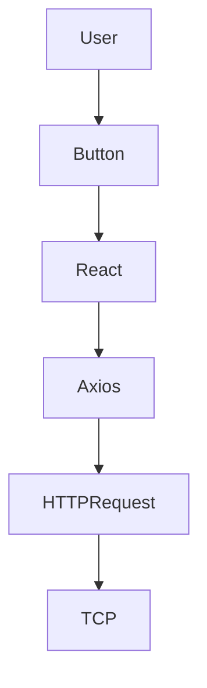

# 📘 Chapter 2 — Complete Request Journey

> 📂 File: `student-results-api-notes/01-Architecture/02-Complete-Request-Journey.md`

---

# 🚀 Introduction

One of the biggest challenges for developers is understanding **what actually happens after clicking a button in a web application**.

Many developers know individual technologies such as:

* 🌐 React
* ☕ Spring Boot
* 🐘 PostgreSQL
* 🐳 Docker
* ☸️ Kubernetes

However, they often struggle to connect these technologies into a **single end-to-end execution flow**.

This chapter follows **one real request** through your Student Results API.

Instead of learning React, Spring Boot, Linux, and PostgreSQL independently, you'll see how they work together as one complete system.

The request we will follow is:

```http
GET /students/1051110244 HTTP/1.1
```

This request begins in the browser and ends only after the result is displayed back on the screen.

---

## Mermaid Snapshot (From deep-dive)



# 🎯 Learning Objectives

After completing this chapter, you will understand:

* 🌐 What happens when a user clicks **Get Result**
* ⚛️ How React handles user interaction
* 📡 How Axios creates an HTTP request
* 🌍 How the browser locates the server
* 🤝 Why TCP establishes a connection first
* 🐧 How Linux receives the request
* 🔌 How sockets and ports identify the application
* ☕ How the JVM receives the request
* 🍃 How Tomcat processes the request
* 🎯 How Spring MVC routes it to the Controller
* 🧠 How the Service executes business logic
* 🗄️ How the Repository queries PostgreSQL
* 🐘 How PostgreSQL executes SQL
* 📦 How JSON is generated
* 🌐 How React updates the UI

---

# 🏗️ Complete End-to-End Journey

The entire request travels through multiple layers.

```text
                                👨‍🎓 User
                                     │
                                     ▼
                         🌐 React Web Application
                                     │
                                     ▼
                          📡 Axios HTTP Client
                                     │
                                     ▼
                            🌍 Browser Network Stack
                                     │
                                     ▼
                           🤝 TCP Connection
                                     │
                                     ▼
                            📨 HTTP Request
                                     │
                                     ▼
                             🐧 Linux Kernel
                                     │
                                     ▼
                            🔌 TCP Socket
                                     │
                                     ▼
                              🚪 Port 8080
                                     │
                                     ▼
                           ☕ Java Process (JVM)
                                     │
                                     ▼
                           🍃 Embedded Tomcat
                                     │
                                     ▼
                          🧵 Tomcat Worker Thread
                                     │
                                     ▼
                         🎯 DispatcherServlet
                                     │
                                     ▼
                           🎯 StudentController
                                     │
                                     ▼
                            🧠 StudentService
                                     │
                                     ▼
                      🗄️ StudentRepository (JPA)
                                     │
                                     ▼
                           ⚙️ Hibernate ORM
                                     │
                                     ▼
                              🔗 JDBC Driver
                                     │
                                     ▼
                           🐘 PostgreSQL Database
                                     │
                                     ▼
                               📊 SQL Execution
                                     │
                                     ▼
                              📦 Result Rows
                                     │
                                     ▼
                            ⚙️ Hibernate Entity
                                     │
                                     ▼
                               📦 DTO Object
                                     │
                                     ▼
                             📄 JSON Response
                                     │
                                     ▼
                           🌐 Browser Receives JSON
                                     │
                                     ▼
                           ⚛️ React Updates State
                                     │
                                     ▼
                          🎨 Material UI Re-renders
                                     │
                                     ▼
                              👨‍🎓 Student Sees Result
```

---

# 💡 The Big Picture

At first glance, the application appears simple.

The user enters a roll number.

```
1051110244
```

Clicks:

```
Get Result
```

and receives:

```text
Name : Nishanth

Math       : 92
English    : 88
Science    : 95
Physics    : 90
Chemistry  : 84
Computer   : 96

Total      : 545
Percentage : 90.83%
Grade      : A+
Result     : PASS
```

To the user, this feels instantaneous.

But internally, the request travels through **more than 20 software components** before the result appears on the screen.

---

# 🧩 Every Layer Has One Responsibility

A common misconception is that Spring Boot performs everything.

In reality, every layer performs a specific job.

| Layer          | Responsibility                            |
| -------------- | ----------------------------------------- |
| 👨‍🎓 User     | Initiates the request                     |
| ⚛️ React       | Collects user input                       |
| 📡 Axios       | Creates the HTTP request                  |
| 🌍 Browser     | Sends the request over the network        |
| 🐧 Linux       | Receives network packets                  |
| 🔌 TCP Socket  | Communication endpoint                    |
| 🚪 Port 8080   | Routes the request to the correct process |
| ☕ JVM          | Runs the Java application                 |
| 🍃 Tomcat      | Parses HTTP and manages request threads   |
| 🎯 Spring MVC  | Routes the request to the Controller      |
| 🧠 Service     | Executes business logic                   |
| 🗄️ Repository | Requests data from the database           |
| ⚙️ Hibernate   | Converts Java objects to SQL              |
| 🔗 JDBC        | Talks to PostgreSQL                       |
| 🐘 PostgreSQL  | Executes SQL queries                      |
| 📦 Jackson     | Converts Java objects into JSON           |
| 🌐 Browser     | Receives the JSON response                |
| ⚛️ React       | Updates the user interface                |

Each component has **exactly one responsibility**. This separation makes the application easier to understand, maintain, test, and scale.

---

# 🎬 The Journey Begins

In the following sections, we'll walk through each stage in detail.

We'll answer questions such as:

* ❓ What actually happens when the button is clicked?
* ❓ Who creates the HTTP request?
* ❓ Who owns port **8080**?
* ❓ How does Linux know which process should receive the packet?
* ❓ Why does Tomcat use worker threads?
* ❓ How does Spring know to call `StudentController`?
* ❓ How does Hibernate generate SQL?
* ❓ How does PostgreSQL return the result?
* ❓ How is JSON generated?
* ❓ How does React update only the changed parts of the page?

By the end of this chapter, you'll have a complete mental model of how a modern web application processes a request from start to finish.

---

# 📌 Chapter Roadmap

```text
👨‍🎓 User Click
        │
        ▼
🌐 Browser & React
        │
        ▼
📡 HTTP Request
        │
        ▼
🐧 Linux Networking
        │
        ▼
☕ JVM & Tomcat
        │
        ▼
🍃 Spring MVC
        │
        ▼
🧠 Business Logic
        │
        ▼
🐘 Database
        │
        ▼
📄 JSON Response
        │
        ▼
⚛️ React Rendering
        │
        ▼
👨‍🎓 Updated UI
```

➡️ **Next Section:** **👨‍🎓 Step 1 – User Clicks "Get Result"**

We'll begin by examining how a simple button click in React starts the entire request lifecycle.
