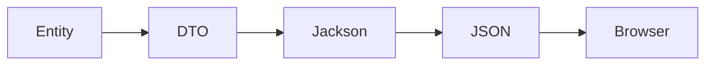

# 📘 Chapter 3 — Response Journey

> 📂 File: `student-results-api-notes/01-Architecture/03-Response-Journey.md`

---

# 🚀 Introduction

The request journey ends when PostgreSQL executes the SQL query.

However, the user still hasn't seen anything on the screen.

Now the application must send the data **back** through every layer until it reaches the browser.

Many developers understand how a request reaches the backend, but fewer understand how the response is constructed, serialized, transmitted, parsed, and finally rendered on the page.

This chapter follows the complete return path.

---

## Mermaid Snapshot (From deep-dive)



# 🎯 Learning Objectives

After completing this chapter you will understand:

* 🐘 How PostgreSQL returns query results
* 🔗 How JDBC creates a `ResultSet`
* ⚙️ How Hibernate maps rows into Java objects
* 🧠 How the Service prepares the response
* 📦 Why DTOs are used
* 📄 How Jackson converts Java objects into JSON
* 🌐 How Tomcat builds an HTTP response
* 📡 How the browser receives the response
* ⚛️ How Axios resolves the Promise
* 🎨 How React updates the UI

---

# 🏗️ Complete Response Flow

```text
                         🐘 PostgreSQL
                               │
                               ▼
                      📊 SQL Result Rows
                               │
                               ▼
                     🔗 JDBC ResultSet
                               │
                               ▼
                    ⚙️ Hibernate Entities
                               │
                               ▼
                  🧠 StudentService Logic
                               │
                               ▼
                     📦 StudentResponse DTO
                               │
                               ▼
                 📄 Jackson JSON Serialization
                               │
                               ▼
                    🌐 HTTP Response Created
                               │
                               ▼
                      🍃 Embedded Tomcat
                               │
                               ▼
                        🐧 Linux Kernel
                               │
                               ▼
                       🔌 TCP Socket
                               │
                               ▼
                       🌍 Browser Network
                               │
                               ▼
                     📡 Axios Promise Resolved
                               │
                               ▼
                     ⚛️ React State Updated
                               │
                               ▼
                  🎨 Material UI Re-rendered
                               │
                               ▼
                       👨‍🎓 Student Sees Result
```

---

# 💡 Why Is the Response Journey Important?

Suppose the database successfully finds the student record.

The information is still **inside PostgreSQL memory**.

The browser cannot directly understand:

* SQL rows
* Java objects
* Hibernate entities
* DTO classes

Instead, the data must be transformed several times before it becomes something the browser can display.

This transformation pipeline is one of the most important concepts in modern web development.

---

# 🐘 Step 1 — PostgreSQL Executes SQL

Earlier, the Repository requested the data.

Hibernate generated SQL similar to:

```sql
SELECT *
FROM students
WHERE roll_number = 1051110244;
```

PostgreSQL executes the query and returns one or more rows.

Example:

| roll_number | first_name | last_name   |
| ----------- | ---------- | ----------- |
| 1051110244  | Nishanth   | Gundlapalle |

For the marks table:

| Subject   | Marks |
| --------- | ----: |
| Math      |    92 |
| English   |    88 |
| Science   |    95 |
| Physics   |    90 |
| Chemistry |    84 |
| Computer  |    96 |

At this point the data is still stored in PostgreSQL's internal memory structures.

---

# 🔗 Step 2 — JDBC Creates a ResultSet

The JDBC driver receives the database response.

It converts the raw database protocol into a Java-friendly structure called a **ResultSet**.

Conceptually:

```text
PostgreSQL

↓

Database Protocol

↓

JDBC Driver

↓

ResultSet
```

A `ResultSet` behaves like a cursor that allows Java to iterate through returned rows.

---

# ⚙️ Step 3 — Hibernate Creates Java Objects

Spring Data JPA does not expose the `ResultSet` directly.

Hibernate maps the rows into Java objects.

Example:

```text
students table row

↓

Student Entity
```

and

```text
student_marks rows

↓

List<StudentMark>
```

This process is called **Object–Relational Mapping (ORM)** because it bridges relational tables and object-oriented classes.

---

# 🧠 Step 4 — Service Layer Builds Business Response

The Service layer now has:

* `Student`
* `List<StudentMark>`

It applies the application's business rules.

Examples:

* ➕ Calculate total marks
* 📊 Calculate percentage
* 🏅 Determine grade
* ✅ Determine PASS or FAIL

Instead of returning the Entity objects directly, the Service prepares a dedicated response object.

```text
Student Entity
      │
      ▼
StudentResponse DTO
```

This ensures the API returns only the information required by the client.

---

# 📦 Step 5 — DTO (Data Transfer Object)

The DTO is designed specifically for communication with the frontend.

Example:

```json
{
  "rollNumber":1051110244,
  "firstName":"Nishanth",
  "lastName":"Gundlapalle",
  "total":545,
  "percentage":90.83,
  "grade":"A+",
  "result":"PASS"
}
```

Notice that internal database details, Hibernate metadata, and persistence information are not exposed.

This is one of the key reasons DTOs are recommended in production applications.

---

# 📌 Part 1 Summary

At this stage:

* 🐘 PostgreSQL has executed the query.
* 🔗 JDBC has created a `ResultSet`.
* ⚙️ Hibernate has mapped rows into Java objects.
* 🧠 The Service has applied business rules.
* 📦 A clean DTO is ready for serialization.

The next step is to transform this DTO into JSON, construct the HTTP response, transmit it back to the browser, and let React update the user interface.

➡️ **Next Part:** **📄 Jackson Serialization → HTTP Response → Browser → React Rendering**

# 📘 Part 2 — DTO → JSON → HTTP Response → Browser → React Rendering

## 🌍 Introduction

In **Part 1**, we followed the request from the browser all the way to PostgreSQL and back into the Spring Boot application.

At this stage:

- 🐘 PostgreSQL has executed the SQL query.
- 🔗 JDBC has received the database response.
- ⚙️ Hibernate has mapped database rows into Java objects.
- 🧠 The Service layer has applied business rules.
- 📦 A DTO (Data Transfer Object) is ready.

The next journey is returning the data to the browser.

This chapter explains what happens after the DTO is returned from the Service until the user finally sees the updated page in React.

---

# 🎯 Learning Objectives

After completing this chapter you will understand:

- Jackson Serialization
- HTTP Response Creation
- Tomcat Response Processing
- Linux TCP/IP Response Flow
- Browser Response Processing
- Axios Promise Resolution
- React State Updates
- Virtual DOM
- Browser Rendering Pipeline

---

# Complete Response Flow

```text
PostgreSQL
      │
      ▼
JDBC ResultSet
      │
      ▼
Hibernate Entity
      │
      ▼
Service Layer
      │
      ▼
DTO
      │
      ▼
Jackson Serialization
      │
      ▼
JSON
      │
      ▼
HTTP Response
      │
      ▼
Tomcat
      │
      ▼
Linux TCP/IP Stack
      │
      ▼
Internet
      │
      ▼
Browser
      │
      ▼
Axios
      │
      ▼
React
      │
      ▼
Virtual DOM
      │
      ▼
Real DOM
      │
      ▼
Browser Rendering Engine
      │
      ▼
GPU
      │
      ▼
Screen
```

---

# Step 1 — Controller Returns DTO

The controller returns a Java object.

```java
@GetMapping("/{rollNumber}")
public StudentResponseDTO getStudent(
        @PathVariable String rollNumber) {

    return studentService.getStudent(rollNumber);
}
```

Notice:

The controller **does not create JSON**.

It simply returns a Java object.

---

# Step 2 — DispatcherServlet Receives the DTO

Execution returns to Spring MVC.

```text
Controller

↓

DispatcherServlet
```

DispatcherServlet asks:

> "How should I send this object back to the client?"

---

# Step 3 — HttpMessageConverter

Spring selects an appropriate message converter.

For REST APIs:

```text
MappingJackson2HttpMessageConverter
```

Flow:

```text
DispatcherServlet

↓

HttpMessageConverter

↓

Jackson
```

---

# Step 4 — Jackson Serialization

Jackson converts the Java object into JSON.

```text
StudentResponseDTO

↓

ObjectMapper

↓

JSON
```

Example DTO

```java
StudentResponseDTO
```

becomes

```json
{
  "rollNumber":"1051110001",
  "firstName":"Nishanth",
  "lastName":"Gundlapalle",
  "subjects":[
      {
          "subject":"Math",
          "marks":95
      }
  ]
}
```

Jackson automatically serializes:

- Strings
- Numbers
- Lists
- Nested Objects

---

# Step 5 — HTTP Response Construction

Spring now builds the HTTP response.

```http
HTTP/1.1 200 OK
Content-Type: application/json
Content-Length: 480

{
   ...
}
```

Response contains

- Status Code
- Headers
- JSON Body

---

# Step 6 — Tomcat Sends the Response

Tomcat writes the response into the socket.

```text
Spring MVC

↓

Tomcat

↓

Socket OutputStream
```

Internally:

```java
OutputStream.write(...)
```

Eventually Tomcat calls the Linux kernel.

---

# Step 7 — Linux Kernel Networking

Linux receives the response bytes.

```text
JSON

↓

TCP

↓

IP

↓

Ethernet
```

The kernel performs:

- TCP segmentation
- IP packet creation
- Ethernet framing

---

# Step 8 — NIC Sends Frames

Network Interface Card (NIC):

```text
Memory

↓

DMA

↓

NIC

↓

Ethernet Cable / WiFi
```

Frames leave the server.

---

# Step 9 — Internet Routing

Routers forward packets.

```text
Server

↓

Switch

↓

Router

↓

ISP

↓

Internet

↓

Client ISP

↓

Client Router

↓

Laptop
```

Every router uses:

```text
Destination IP Address
```

to decide the next hop.

---

# Step 10 — Browser Receives Packets

Laptop NIC receives Ethernet frames.

Linux kernel performs:

```text
Ethernet

↓

IP

↓

TCP

↓

HTTP
```

TCP reconstructs the original byte stream.

---

# Step 11 — Browser HTTP Stack

Browser receives:

```http
HTTP/1.1 200 OK
```

Browser parses:

- Status
- Headers
- JSON

---

# Step 12 — Axios Receives Response

Axios resolves its Promise.

```javascript
axios.get("/students/1051110001")
```

becomes

```javascript
response.data
```

Example:

```javascript
{
    rollNumber:"1051110001",
    firstName:"Nishanth"
}
```

---

# Step 13 — React Updates State

Component updates state.

```javascript
setStudent(response.data)
```

React detects:

```text
State Changed
```

---

# Step 14 — Virtual DOM

React creates a new Virtual DOM.

```text
Old Virtual DOM

↓

New Virtual DOM

↓

Diff
```

React identifies:

```text
Only Changed Elements
```

---

# Step 15 — Real DOM Update

React updates only modified DOM nodes.

```text
Virtual DOM

↓

Real DOM
```

Instead of rebuilding the entire page.

---

# Step 16 — Browser Rendering Pipeline

Browser rendering engine executes:

```text
DOM

↓

CSSOM

↓

Render Tree

↓

Layout

↓

Paint

↓

Composite
```

Each stage prepares the page for display.

---

# Step 17 — GPU Composition

Browser sends drawing commands.

```text
Browser

↓

GPU

↓

Frame Buffer
```

GPU composes the final image.

---

# Step 18 — Pixels on Screen

Monitor refreshes.

```text
Frame Buffer

↓

Monitor

↓

Pixels
```

The student result is now visible.

---

# Complete End-to-End Response Journey

```text
Service Layer
      │
      ▼
StudentResponseDTO
      │
      ▼
DispatcherServlet
      │
      ▼
HttpMessageConverter
      │
      ▼
Jackson ObjectMapper
      │
      ▼
JSON
      │
      ▼
HTTP Response
      │
      ▼
Tomcat
      │
      ▼
Linux Socket
      │
      ▼
TCP
      │
      ▼
IP
      │
      ▼
Ethernet
      │
      ▼
NIC
      │
      ▼
Internet
      │
      ▼
Browser TCP Stack
      │
      ▼
HTTP Parser
      │
      ▼
Axios
      │
      ▼
React State
      │
      ▼
Virtual DOM
      │
      ▼
Real DOM
      │
      ▼
Rendering Engine
      │
      ▼
GPU
      │
      ▼
Pixels on Screen
```

---

# Key Components

| Component | Responsibility |
|------------|----------------|
| Service | Applies business logic |
| DTO | Transfers data to the controller |
| DispatcherServlet | Coordinates the response |
| HttpMessageConverter | Converts Java objects to HTTP body |
| Jackson | Serializes Java objects into JSON |
| Tomcat | Sends HTTP response |
| Linux Kernel | TCP/IP networking |
| Browser | Parses HTTP response |
| Axios | Resolves HTTP Promise |
| React | Updates application state |
| Virtual DOM | Detects UI changes |
| Browser Rendering Engine | Builds the page |
| GPU | Renders pixels to the display |

---

# Summary

At this stage:

- ✅ Service created the DTO.
- ✅ Spring MVC selected Jackson.
- ✅ Jackson serialized the DTO into JSON.
- ✅ Spring created the HTTP response.
- ✅ Tomcat wrote the response to the socket.
- ✅ Linux transmitted TCP/IP packets.
- ✅ Browser reconstructed the HTTP response.
- ✅ Axios resolved the Promise.
- ✅ React updated component state.
- ✅ Virtual DOM detected changes.
- ✅ Real DOM was updated.
- ✅ Browser rendered the page.
- ✅ GPU displayed the final pixels on the screen.

---

# Next Chapter

📘 **Part 3 — Browser Rendering Internals**

Topics:

- Browser Process Architecture
- JavaScript Event Loop
- Call Stack
- Web APIs
- Microtasks vs Macrotasks
- React Reconciliation
- Browser Rendering Engine
- GPU Composition
- Frame Rendering (60 FPS)
- Performance Optimization

By the end of the next chapter, you'll understand exactly **how the browser converts JSON into visible pixels on the screen**.
