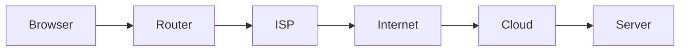

# 📘 Chapter 11 — IP Routing

> 📂 File: `student-results-api-notes/02-Network/06-IP-Routing.md`

---

# 🌍 Introduction

In the previous chapter we learned how DNS converts a hostname into an IP address.

Example:

```text
student-api.example.com

↓

50.17.121.255
```

Now the browser knows **where** the server is.

However, another question immediately arises:

> **How does the packet travel from my laptop to that server?**

The answer is **IP Routing**.

Every packet sent across the Internet is forwarded from one router to another until it reaches its final destination.

Your Student Results API request may travel through:

* 🖥️ Your Laptop
* 📶 Wi-Fi Router
* 🌐 ISP Network
* 🌍 Internet Backbone
* ☁️ AWS Edge Network
* 🌐 AWS VPC Router
* 🖥️ EC2 Instance
* 🐧 Linux Kernel
* ☕ Spring Boot

All of this happens in milliseconds.

---

## Mermaid Snapshot (From deep-dive)



# 🎯 Learning Objectives

After completing this chapter you will understand:

* 🌍 What IP routing is
* 📦 IP packet forwarding
* 🛣️ Routing tables
* 🚪 Default gateways
* 🌐 Routers
* 🧩 Subnets
* 📡 CIDR notation
* ☁️ AWS VPC routing
* 🐧 Linux routing
* 🐳 Docker bridge routing
* ☸️ Kubernetes Pod routing
* 🧪 Linux routing tools

---

# ❓ Why Routing Exists

Suppose your laptop has this IP address:

```text
192.168.1.20
```

Your Spring Boot server runs on:

```text
50.17.121.255
```

These two machines are **not on the same network**.

Your laptop cannot directly transmit Ethernet frames to an EC2 instance on AWS.

Instead, the packet must pass through multiple routers.

Routing decides **where the packet should go next**.

---

# 🏗️ Complete Routing Journey

```text
                 👨‍🎓 User
                      │
                      ▼
              💻 Laptop
                      │
                      ▼
             📶 Home Wi-Fi
                      │
                      ▼
          🚪 Default Gateway
                      │
                      ▼
              🌐 ISP Router
                      │
                      ▼
          🌍 Internet Backbone
                      │
                      ▼
            ☁️ AWS Edge Router
                      │
                      ▼
              🌐 AWS VPC Router
                      │
                      ▼
             🖥️ EC2 Instance
                      │
                      ▼
              🐧 Linux Kernel
                      │
                      ▼
               🍃 Tomcat
                      │
                      ▼
             ☕ Spring Boot
```

Each router forwards the packet one hop closer to the destination.

---

# 📦 What Is an IP Packet?

After TCP creates a segment, IP wraps it in an IP packet.

```text
+--------------------------------------+
| IP Header                            |
|--------------------------------------|
| Source IP                            |
| Destination IP                       |
| TTL                                  |
| Protocol (TCP)                       |
| Checksum                             |
+--------------------------------------+
| TCP Segment                          |
+--------------------------------------+
```

The IP layer is responsible for **delivery between networks**.

---

# 🗺️ Source and Destination IP

Example:

```text
Source IP      : 192.168.1.20
Destination IP : 50.17.121.255
```

The source IP identifies the sender.

The destination IP identifies the receiver.

Routers inspect only the destination IP when deciding where to forward the packet.

---

# 🛣️ What Is a Routing Table?

Every operating system maintains a routing table.

Linux uses it to answer one question:

> "Where should this packet go next?"

Display it:

```bash
ip route
```

Example:

```text
default via 172.31.16.1 dev eth0

172.31.16.0/20 dev eth0 proto kernel

127.0.0.0/8 dev lo
```

Each entry is called a **route**.

---

# 🚪 Default Gateway

When Linux does not have a specific route, it uses the default gateway.

Example:

```text
Destination

50.17.121.255

↓

Unknown Network

↓

Default Gateway

↓

172.31.16.1
```

The default gateway is usually your nearest router.

---

# 🌐 Router

A router connects multiple networks.

```text
        Network A

192.168.1.0/24

        │

        ▼

      🌐 Router

        ▲

        │

50.17.121.0/24

Network B
```

Routers inspect the destination IP and forward packets accordingly.

---

# 📡 CIDR Notation

Networks are represented using CIDR.

Example:

```text
192.168.1.0/24
```

Meaning:

* Network Address: `192.168.1.0`
* Mask: `255.255.255.0`
* Hosts: `192.168.1.1` to `192.168.1.254`

Another example:

```text
172.31.16.0/20
```

This is commonly used inside AWS VPCs.

---

# ⏳ Time To Live (TTL)

Every IP packet contains a **TTL** value.

Example:

```text
TTL = 64
```

Each router decreases it by one.

```text
64

↓

63

↓

62

↓

61
```

If TTL reaches zero, the packet is discarded.

This prevents routing loops from circulating packets forever.

---

# 🐧 Linux Routing Decision

When Linux receives a packet:

```text
Packet Arrives

↓

Read Destination IP

↓

Lookup Routing Table

↓

Find Best Route

↓

Forward Packet
```

Linux always chooses the **longest prefix match**, meaning the most specific route.

---

# ☁️ AWS VPC Routing

In AWS, packets traverse several networking components before reaching your EC2 instance.

```text
Internet

↓

Internet Gateway (IGW)

↓

VPC Route Table

↓

Subnet

↓

Elastic Network Interface (ENI)

↓

EC2 Instance

↓

Linux Kernel

↓

Spring Boot
```

The VPC route table determines whether traffic stays inside the VPC or is forwarded to the Internet Gateway.

---

# 🐳 Docker Routing

Docker creates a virtual bridge network.

Example:

```text
Browser

↓

Host Linux

↓

docker0 Bridge

↓

veth Pair

↓

Container

↓

Spring Boot
```

The host routes packets into the correct container using bridge networking and NAT.

---

# ☸️ Kubernetes Routing

Kubernetes extends routing to Pods and Services.

```text
Browser

↓

Ingress

↓

Service

↓

Pod IP

↓

Container

↓

Tomcat
```

Each Pod receives its own IP address, and the cluster network routes packets directly to the correct Pod.

---

# 📊 End-to-End Packet Journey

```text
Browser
   │
   ▼
Laptop NIC
   │
   ▼
Home Router
   │
   ▼
ISP
   │
   ▼
Internet Backbone
   │
   ▼
AWS Edge
   │
   ▼
Internet Gateway
   │
   ▼
VPC Router
   │
   ▼
EC2 ENI
   │
   ▼
Linux Routing Table
   │
   ▼
Socket (Port 8080)
   │
   ▼
Tomcat
   │
   ▼
Spring Boot
```

This illustrates how routing bridges the gap between the public Internet and your application.

---

# 🧪 Hands-on Lab

## View Routing Table

```bash
ip route
```

---

## Display Network Interfaces

```bash
ip addr
```

---

## Show Default Gateway

```bash
ip route | grep default
```

---

## Trace the Packet Path

```bash
traceroute google.com
```

or

```bash
tracepath google.com
```

Observe each router hop between your machine and the destination.

---

## Display ARP Cache

```bash
ip neigh
```

This shows IP-to-MAC address mappings for devices on your local network.

---

# 💡 Key Takeaways

✅ IP routing moves packets between different networks.

✅ Routers inspect destination IP addresses to determine the next hop.

✅ Linux maintains a routing table and chooses the most specific route.

✅ The default gateway forwards traffic to external networks.

✅ TTL prevents routing loops.

✅ AWS, Docker, and Kubernetes all build additional networking abstractions on top of standard IP routing.

---

# ➡️ Next Chapter

📘 **02-Network/07-Socket.md**

In the next chapter we'll dive into one of the most important networking concepts in Linux:

* 🔌 What is a socket?
* 🧠 Socket data structures inside the Linux kernel
* 📞 `socket()`, `bind()`, `listen()`, `accept()`
* 📨 Send and receive buffers
* 🧵 How Tomcat uses sockets
* ☕ How one socket becomes one HTTP request
* 🐳 Docker sockets
* ☸️ Kubernetes socket communication

By the end of the next chapter you'll understand exactly how Linux delivers network data to the Java process that runs your Student Results API.
