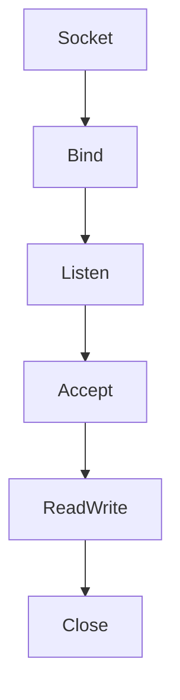

# 📘 Chapter 12 — Linux Sockets

> 📂 File: `student-results-api-notes/02-Network/07-Socket.md`

---

# 🌍 Introduction

After DNS resolves the hostname...

After IP routing finds the destination...

After the TCP three-way handshake completes...

A new question appears:

> **How does the Linux kernel actually deliver network data to the Java process?**

The answer is:

# 🔌 Sockets

A socket is one of the most fundamental abstractions in operating systems.

Every network application relies on sockets:

* 🌐 Chrome
* 🦊 Firefox
* 🍃 Tomcat
* ☕ Spring Boot
* 🐘 PostgreSQL
* 🐳 Docker
* ☸️ Kubernetes
* 🔐 SSH
* 📡 Nginx

Without sockets, applications could never communicate over a network.

---

## Mermaid Snapshot (From deep-dive)



# 🎯 Learning Objectives

After completing this chapter you will understand:

* 🔌 What a socket is
* 🧠 Linux socket architecture
* 📦 Socket buffers
* 📞 `socket()`
* 📌 `bind()`
* 👂 `listen()`
* 🤲 `accept()`
* 📨 `recv()`
* 📤 `send()`
* 🧵 How Tomcat uses sockets
* 🐧 Kernel vs User Space
* 🐳 Docker sockets
* ☸️ Kubernetes networking
* 🧪 Linux socket debugging

---

# ❓ What Is a Socket?

A socket is **an endpoint for communication**.

Think of it as a virtual communication channel between two processes.

```text
Chrome

↓

Socket

~~~~~~~~ Internet ~~~~~~~~

Socket

↓

Spring Boot
```

The browser writes bytes into its socket.

The Linux kernel transports those bytes.

Tomcat reads the bytes from its socket.

---

# 🏗️ Complete Socket Architecture

```text
                    USER SPACE

+--------------------------------------------+

⚛️ React

↓

🌐 Browser

↓

☕ JVM

↓

🍃 Tomcat

↓

Java Socket API

+--------------------------------------------+

              System Call Boundary

================ syscall =====================

                 KERNEL SPACE

+--------------------------------------------+

TCP Socket

↓

Socket Buffer

↓

TCP Stack

↓

IP Layer

↓

Ethernet Driver

↓

NIC Driver

↓

Network Card

+--------------------------------------------+
```

Applications never communicate directly with the network card.

Everything passes through the Linux socket layer.

---

# 🔌 Socket vs Port

Many beginners confuse sockets and ports.

They are different.

## Port

A port identifies an application.

Example:

```text
8080
```

Tomcat listens on port 8080.

---

## Socket

A socket is the actual communication endpoint.

Example:

```text
192.168.1.10:54012

↓

50.17.121.255:8080
```

The socket represents the connection itself.

One port can have thousands of sockets.

---

# 📞 socket()

Every network server starts by asking Linux to create a socket.

Conceptually:

```c
socket(AF_INET, SOCK_STREAM)
```

Linux allocates:

* TCP Control Block
* Receive Buffer
* Send Buffer
* Socket Structure

Initially:

```text
Socket

↓

CLOSED
```

No communication is possible yet.

---

# 📌 bind()

Tomcat binds the socket.

```c
bind(socket, 0.0.0.0:8080)
```

Linux now associates:

```text
Port 8080

↓

Listening Socket

↓

Java Process
```

Verify:

```bash
ss -ltnp
```

Example:

```text
LISTEN 0 100 *:8080 users:(("java",pid=7065))
```

---

# 👂 listen()

Next Tomcat executes:

```c
listen(socket)
```

The socket changes state.

```text
CLOSED

↓

LISTEN
```

Linux creates two internal queues:

```text
Incoming SYN Queue

↓

Completed Connection Queue
```

The listening socket waits for new TCP connections.

---

# 🤲 accept()

After the TCP handshake completes:

Tomcat executes:

```c
accept()
```

Linux creates a brand-new connected socket.

```text
Listening Socket

↓

accept()

↓

Connected Socket
```

Important:

The listening socket **never carries HTTP data**.

Every client receives its own connected socket.

---

# 📨 recv()

Tomcat now waits for bytes.

Conceptually:

```c
recv(socket)
```

The kernel copies bytes from the socket receive buffer into Tomcat.

```text
NIC

↓

TCP

↓

Socket Buffer

↓

recv()

↓

Tomcat
```

Tomcat now begins parsing HTTP.

---

# 📤 send()

When Spring Boot returns a response:

Tomcat calls:

```c
send(socket)
```

The reverse happens.

```text
Spring Boot

↓

Tomcat

↓

Socket Buffer

↓

TCP

↓

NIC

↓

Browser
```

---

# 🧠 Socket Buffers

Every TCP socket contains two buffers.

```text
            Socket

     +------------------+

Receive Buffer

Send Buffer

     +------------------+
```

## Receive Buffer

Stores incoming bytes until the application reads them.

## Send Buffer

Stores outgoing bytes until the network transmits them.

Without buffers, network communication would block continuously.

---

# 🔄 Complete Socket Lifecycle

```text
socket()

↓

bind()

↓

listen()

↓

accept()

↓

recv()

↓

send()

↓

close()
```

Every TCP server follows this lifecycle.

Tomcat is no exception.

---

# 🧵 One Connection = One Connected Socket

Suppose 500 users access your Student Results API.

Linux creates:

```text
Listening Socket

↓

Socket #1

Socket #2

Socket #3

...

Socket #500
```

Each socket has:

* Receive Buffer
* Send Buffer
* TCP State
* Source/Destination IP
* Source/Destination Port

---

# 🧵 Socket and Tomcat Worker Threads

Linux accepts the connection.

Tomcat assigns it to a worker thread.

```text
Connected Socket

↓

http-nio-8080-exec-7

↓

DispatcherServlet

↓

Controller

↓

Service

↓

Repository
```

The worker thread reads data only from its assigned socket.

---

# 🐧 Linux View

Linux sees something like:

```text
Java Process (PID 7065)

↓

Socket

↓

Thread

↓

Socket

↓

Thread

↓

Socket

↓

Thread
```

The kernel manages sockets.

The JVM manages threads.

---

# 📊 Complete Communication Flow

```text
Browser

↓

Client Socket

↓

Internet

↓

Server Socket

↓

Linux Kernel

↓

Tomcat

↓

DispatcherServlet

↓

StudentController

↓

StudentService

↓

Repository

↓

PostgreSQL
```

The response follows the exact reverse path.

---

# 🐳 Docker Perspective

Docker does not replace sockets.

Instead:

```text
Browser

↓

Host Socket

↓

docker0 Bridge

↓

veth Pair

↓

Container Namespace

↓

Socket

↓

Tomcat
```

The socket still belongs to the Linux kernel.

Docker simply changes the networking path.

---

# ☸️ Kubernetes Perspective

Inside Kubernetes:

```text
Browser

↓

Ingress

↓

Service

↓

Pod IP

↓

Container

↓

Socket

↓

Tomcat
```

Each Pod still receives packets through Linux sockets.

The Kubernetes networking stack eventually delivers data to the same socket interface.

---

# 🧪 Hands-on Lab

## Display Listening Sockets

```bash
ss -ltnp
```

---

## Display Established Connections

```bash
ss -tan
```

---

## Display Process File Descriptors

Find the Java PID:

```bash
ps -ef | grep java
```

Display its open sockets:

```bash
ls -l /proc/<PID>/fd
```

Notice entries such as:

```text
socket:[38492]
socket:[38495]
```

These are kernel-managed socket file descriptors.

---

## Observe Connections During Load Test

Start the application:

```bash
java -jar student-results-api.jar
```

Generate traffic:

```bash
ab -n 10000 -c 100 \
http://localhost:8080/students/1051110244
```

Monitor sockets:

```bash
watch -n1 "ss -tan | grep :8080"
```

Observe many sockets entering:

* `ESTABLISHED`
* `TIME-WAIT`
* `CLOSE-WAIT`

---

## Count Open Socket File Descriptors

```bash
ls /proc/<PID>/fd | wc -l
```

You'll notice the number increases with active network connections because sockets are represented as **file descriptors** in Linux.

---

# 💡 Key Takeaways

✅ A socket is the communication endpoint between two applications.

✅ The Linux kernel owns and manages sockets.

✅ Tomcat interacts with sockets using standard system calls.

✅ Every client receives a dedicated connected socket after `accept()`.

✅ Each TCP socket has its own receive and send buffers.

✅ Multiple clients share the same listening port but never the same connected socket.

✅ Docker and Kubernetes build additional networking layers, but ultimately rely on Linux sockets to deliver data to applications.

---

# 🎉 Networking Foundation Complete

At this point you now understand:

* ✅ OSI Model
* ✅ TCP/IP
* ✅ TCP Three-Way Handshake
* ✅ HTTP Requests
* ✅ DNS Resolution
* ✅ IP Routing
* ✅ Linux Sockets

You now have the networking knowledge required to understand **how a browser reaches your Spring Boot application**.

---

# ➡️ Next Part

📂 **03-Linux**

The next chapter is:

**📘 `03-Linux/01-Linux-Boot-Process.md`**

We'll move below the networking layer and study the operating system itself:

* 🖥️ BIOS/UEFI
* 💿 Bootloader (GRUB)
* 🐧 Linux Kernel initialization
* ⚙️ `systemd`
* 🧵 Process creation
* 📁 Root filesystem mounting
* 🌐 Network initialization
* 🚀 How your Spring Boot application eventually starts as a Linux process

By the end of the Linux section, you'll understand what happens from the instant an EC2 instance powers on until your Java process begins listening on port **8080**.
