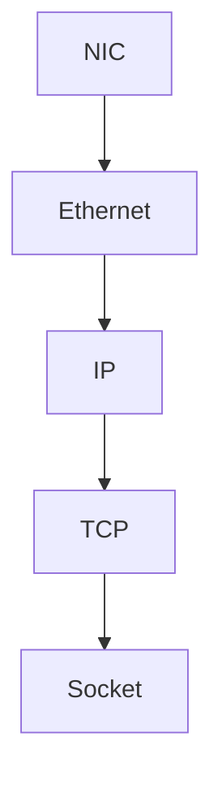

# 📘 Chapter 14 — Linux Network Stack

> 📂 File: `student-results-api-notes/02-Network/09-Linux-Network-Stack.md`

---

# 🌍 Introduction

Your browser sends this request:

```http
GET /students/1051110244 HTTP/1.1
Host: localhost:8080
```

Within a few milliseconds, your Spring Boot controller executes:

```java
@GetMapping("/students/{rollNumber}")
public StudentResponse getStudentResult(...)
```

What happened between these two moments?

The answer is:

> **The Linux Network Stack**

Before Tomcat receives even a single byte, the request passes through multiple Linux kernel subsystems.

The packet travels through:

* 📡 Network Interface Card (NIC)
* 🚗 Device Driver
* 📦 DMA (Direct Memory Access)
* ⚡ Hardware Interrupts
* 🧵 SoftIRQs
* 📥 `sk_buff` (Socket Buffer)
* 🌐 Ethernet Layer
* 🗺️ IP Layer
* 🚚 TCP Layer
* 🔌 Socket Layer
* 👂 Listening Socket
* 🤲 Connected Socket
* 🍃 Tomcat
* ☕ Spring Boot

Only after completing this journey does Spring MVC begin processing the HTTP request.

---

## Mermaid Snapshot (From deep-dive)



# 🎯 Learning Objectives

After completing this chapter you will understand:

* 🖥️ Network Interface Cards (NICs)
* 🚗 Linux network drivers
* ⚡ Hardware interrupts
* 🧵 SoftIRQs
* 📦 DMA
* 📥 `sk_buff`
* 🌐 Ethernet processing
* 🗺️ IP processing
* 🚚 TCP processing
* 🔌 Socket lookup
* 📂 Receive queues
* 🧠 Kernel vs User Space
* 🍃 How Tomcat receives data
* 🧪 Linux networking tools

---

# 🏗️ Complete Linux Network Stack

```text
                        USER SPACE
+------------------------------------------------+

🌐 Browser

↓

☕ JVM

↓

🍃 Tomcat

↓

Java Socket API

==================================================
               System Call Boundary
==================================================

                    KERNEL SPACE

┌──────────────────────────────────────────────┐
│ 🔌 Socket Layer                             │
├──────────────────────────────────────────────┤
│ 🚚 TCP Layer                                │
├──────────────────────────────────────────────┤
│ 🗺️ IP Layer                                 │
├──────────────────────────────────────────────┤
│ 🌐 Ethernet Layer                           │
├──────────────────────────────────────────────┤
│ 📥 sk_buff                                  │
├──────────────────────────────────────────────┤
│ ⚡ SoftIRQ                                  │
├──────────────────────────────────────────────┤
│ 🚗 Network Driver                           │
├──────────────────────────────────────────────┤
│ 📡 NIC (Network Card)                       │
└──────────────────────────────────────────────┘
```

The request always travels **from the bottom up** before reaching your application.

---

# 🌐 Step 1 — Packet Arrives at the NIC

The physical network delivers electrical or radio signals to the Network Interface Card.

```text
Internet

↓

Ethernet Cable / Wi-Fi

↓

NIC
```

The NIC converts these signals into digital frames.

At this stage, the CPU has not processed the packet yet.

---

# 📦 Step 2 — DMA (Direct Memory Access)

Instead of copying every packet through the CPU, modern NICs use **DMA**.

```text
NIC

↓

DMA Engine

↓

RAM
```

DMA transfers the packet directly into main memory.

Benefits:

* 🚀 Lower CPU usage
* ⚡ Faster packet processing
* 📈 Higher throughput

---

# ⚡ Step 3 — Hardware Interrupt

After the packet reaches memory, the NIC raises a hardware interrupt.

```text
Packet Received

↓

NIC Interrupt

↓

CPU
```

The CPU temporarily pauses its current work and notifies the kernel that new network data has arrived.

---

# 🧵 Step 4 — SoftIRQ

Linux minimizes the amount of work performed inside the hardware interrupt.

Instead, it schedules a **SoftIRQ**.

```text
Hardware Interrupt

↓

NET_RX SoftIRQ

↓

Network Processing
```

SoftIRQs allow Linux to process high network traffic efficiently without blocking the CPU.

---

# 📥 Step 5 — sk_buff

Linux wraps every incoming packet inside an internal kernel structure called:

```text
sk_buff
```

(`socket buffer`)

Conceptually:

```text
+---------------------------+
| sk_buff                   |
|---------------------------|
| Ethernet Header           |
| IP Header                 |
| TCP Header                |
| Payload                   |
| Metadata                  |
+---------------------------+
```

Every packet inside Linux is represented by an `sk_buff`.

---

# 🌐 Step 6 — Ethernet Layer

Linux first validates the Ethernet frame.

It checks:

* Destination MAC address
* Source MAC address
* EtherType
* Frame Check Sequence (FCS)

If the frame is valid, the Ethernet header is removed and the IP packet is passed upward.

---

# 🗺️ Step 7 — IP Layer

The IP layer examines:

```text
Destination IP

↓

50.17.121.255
```

Linux verifies:

* Is this packet for me?
* Should it be forwarded?
* Is the TTL still valid?

If the destination matches the local machine, the packet proceeds to the TCP layer.

---

# 🚚 Step 8 — TCP Layer

The TCP layer processes:

* Sequence numbers
* Acknowledgements
* Window size
* Checksums
* Connection state

It verifies that the packet belongs to an existing TCP connection.

If necessary, it also:

* Reorders packets
* Retransmits missing segments
* Updates receive windows

---

# 🔌 Step 9 — Socket Lookup

Linux now identifies the correct socket.

It uses the TCP 4-tuple:

```text
Source IP

+

Source Port

+

Destination IP

+

Destination Port
```

Example:

```text
192.168.1.20:54122

↓

50.17.121.255:8080
```

The kernel searches its socket table.

```text
Port 8080

↓

Listening Socket

↓

Connected Socket
```

If no matching socket exists, the packet is discarded.

---

# 📂 Step 10 — Receive Queue

Each connected socket has its own receive queue.

```text
Connected Socket

↓

Receive Queue

↓

HTTP Bytes Waiting
```

Incoming bytes remain here until the application reads them.

---

# 🍃 Step 11 — Tomcat Calls recv()

Tomcat waits for incoming data.

Conceptually:

```c
recv(socket)
```

The kernel copies bytes from the socket receive queue into Tomcat's memory.

```text
Socket Buffer

↓

recv()

↓

Tomcat
```

Tomcat now has the raw HTTP request.

---

# 📄 Step 12 — HTTP Parsing

Tomcat parses:

```http
GET /students/1051110244 HTTP/1.1
Host: localhost:8080
Accept: application/json
```

It creates:

* Request object
* Header collection
* Parameter map
* HTTP method
* URI

Finally, it invokes Spring MVC.

---

# 🎯 Step 13 — Spring Boot Takes Over

At this point the Linux kernel has finished its work.

The flow continues inside the JVM:

```text
DispatcherServlet

↓

StudentController

↓

StudentService

↓

Repository

↓

PostgreSQL
```

Everything from this point onward is application-level processing.

---

# 🔄 Complete Packet Journey

```text
Browser
   │
   ▼
Internet
   │
   ▼
NIC
   │
   ▼
DMA
   │
   ▼
Hardware Interrupt
   │
   ▼
SoftIRQ
   │
   ▼
sk_buff
   │
   ▼
Ethernet
   │
   ▼
IP
   │
   ▼
TCP
   │
   ▼
Socket Lookup
   │
   ▼
Receive Queue
   │
   ▼
recv()
   │
   ▼
Tomcat
   │
   ▼
DispatcherServlet
   │
   ▼
StudentController
```

---

# 🐳 Docker Perspective

Inside Docker the stack becomes:

```text
Browser

↓

Host NIC

↓

Linux Network Stack

↓

docker0 Bridge

↓

veth Pair

↓

Container Network Namespace

↓

Container Socket

↓

Tomcat
```

Docker adds networking components, but packet processing still relies on the same Linux network stack.

---

# ☸️ Kubernetes Perspective

In Kubernetes:

```text
Browser

↓

Internet

↓

Ingress

↓

Service

↓

kube-proxy

↓

Pod veth

↓

Container Socket

↓

Tomcat
```

Even with Services, Ingresses, and CNI plugins, the final delivery still uses the Linux TCP/IP stack and sockets.

---

# 🧪 Hands-on Lab

## Display Network Interfaces

```bash
ip link
```

---

## Display Interface Statistics

```bash
ip -s link
```

---

## Monitor TCP Connections

```bash
ss -tan
```

---

## Capture Live Packets

```bash
sudo tcpdump -i any port 8080
```

---

## Observe Interrupts

```bash
cat /proc/interrupts
```

Watch the counters increase while generating traffic.

---

## View SoftIRQs

```bash
cat /proc/softirqs
```

Observe the `NET_RX` counter increasing during HTTP requests.

---

## Generate Load

```bash
ab -n 10000 -c 100 http://localhost:8080/students/1051110244
```

While the load test runs, monitor:

```bash
top
```

and

```bash
watch -n1 "ss -tan | grep :8080"
```

You'll see active connections while the Linux kernel processes incoming packets.

---

# 💡 Key Takeaways

✅ Every incoming packet first reaches the NIC.

✅ DMA copies packets into RAM without involving the CPU in every byte transfer.

✅ Hardware interrupts notify Linux of new packets.

✅ SoftIRQs perform scalable network processing.

✅ Every packet is represented by an `sk_buff` inside the kernel.

✅ Linux validates Ethernet, IP, and TCP before delivering data to a socket.

✅ Socket receive queues buffer incoming bytes until Tomcat reads them.

✅ Only after all kernel processing is complete does Spring Boot begin executing your application logic.

---

# 🎉 Networking Module Complete

You now understand the entire networking path:

```text
React
   ↓
Axios
   ↓
DNS
   ↓
TCP Handshake
   ↓
HTTP Request
   ↓
IP Routing
   ↓
NIC
   ↓
Linux Network Stack
   ↓
Socket
   ↓
Tomcat
   ↓
Spring Boot
   ↓
PostgreSQL
```

This provides a complete mental model of how a browser request becomes a Spring Boot method invocation.

---

# ➡️ Next Part

📂 **03-Linux**

We'll now shift from networking to the operating system itself, beginning with:

**📘 `03-Linux/01-Linux-Boot-Process.md`**

You'll learn how a machine boots from power-on through BIOS/UEFI, GRUB, kernel initialization, `systemd`, process creation, and finally to your Java application listening on port **8080**.
