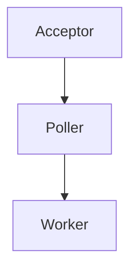

# 📘 Chapter 35 — Apache Tomcat Architecture

> 📂 File: `student-results-api-notes/05-Tomcat/01-Tomcat-Architecture.md`

This chapter begins the Tomcat module, which is where everything you've learned about Linux and the JVM finally comes together.

Up until now you've learned:

Browser → TCP → Socket → Linux Network Stack
Linux Process → Thread → Scheduler → epoll
JVM → Heap → Stack → ClassLoader → JIT → GC

Now you'll answer the next question:

After Linux delivers an HTTP request to the Java process, how does Tomcat receive it, parse it, execute Spring Boot, and return the response?

This chapter serves as the foundation for the entire Tomcat section.

---

# 🌍 Introduction

So far in this handbook, we've followed the HTTP request through Linux and the JVM.

We learned:

```text
Browser
    │
    ▼
TCP
    │
    ▼
Linux Socket
    │
    ▼
Java Process
    │
    ▼
JVM
```

But another important question appears:

> 🤔 **Once the request reaches the JVM, who receives it?**

The answer is:

# 🐱 Apache Tomcat

Tomcat is the **embedded web server** inside Spring Boot.

When you execute:

```bash
java -jar student-results-api.jar
```

Spring Boot automatically starts Tomcat.

Tomcat is responsible for:

* 🌐 Listening on TCP Port 8080
* 📥 Accepting HTTP connections
* 📄 Parsing HTTP requests
* 🧵 Managing worker threads
* 🚀 Invoking Spring Boot
* 📤 Sending HTTP responses

Without Tomcat, Spring Boot would never receive an HTTP request.

---

## Mermaid Snapshot (From deep-dive)



# 🎯 Learning Objectives

After completing this chapter you will understand:

* 🐱 What Apache Tomcat is
* 🌐 Embedded Tomcat
* ⚙️ Tomcat Architecture
* 🔌 Connectors
* 🧵 Thread Pools
* 📥 Request Processing
* 📤 Response Processing
* 📚 Containers
* 🍃 Spring Boot Integration
* 🐳 Docker
* ☸️ Kubernetes
* 🧪 Tomcat Debugging

---

# ❓ What Is Apache Tomcat?

Apache Tomcat is a **Java Servlet Container** and **HTTP Server**.

It implements the Jakarta Servlet specification.

Tomcat converts raw HTTP traffic into Java Servlet objects.

Conceptually:

```text
Browser

↓

HTTP Request

↓

Tomcat

↓

Servlet

↓

Spring Boot
```

Tomcat itself **does not understand your business logic**.

Instead, it provides the infrastructure that allows Spring Boot to execute your code.

---

# 🌱 Embedded Tomcat

Traditional Java applications required:

```text
Application WAR

↓

Install Tomcat

↓

Deploy WAR
```

Spring Boot changed this model.

Now:

```bash
java -jar student-results-api.jar
```

contains:

* Your application
* Spring Boot
* Embedded Tomcat
* Dependencies

Everything runs in one JVM process.

---

# 🏗️ Complete Architecture

```text
                        Browser
                           │
                           ▼
                    HTTP Request
                           │
                           ▼
                 Linux TCP Socket
                           │
                           ▼
+---------------------------------------------------------+
|                     Apache Tomcat                       |
|---------------------------------------------------------|
| 🔌 Connector (HTTP/1.1)                                 |
|---------------------------------------------------------|
| 🧵 Acceptor Thread                                      |
|---------------------------------------------------------|
| ⚡ Poller Thread (epoll / NIO)                          |
|---------------------------------------------------------|
| 👷 Worker Thread Pool                                   |
|---------------------------------------------------------|
| 📦 Catalina Container                                  |
|---------------------------------------------------------|
| 🚀 Servlet Engine                                       |
+---------------------------------------------------------+
                           │
                           ▼
                    Spring Boot
                           │
                           ▼
                DispatcherServlet
                           │
                           ▼
                 StudentController
                           │
                           ▼
                  StudentService
                           │
                           ▼
                StudentRepository
                           │
                           ▼
                    PostgreSQL
```

This is the complete Tomcat execution architecture.

---

# 🧩 Major Tomcat Components

Tomcat consists of several major subsystems.

```text
Tomcat

├── Connector

├── Protocol Handler

├── Acceptor

├── Poller

├── Worker Threads

├── Catalina

├── Servlet Engine

├── Session Manager

└── Request Processor
```

Each component has a specific responsibility.

---

# 🔌 Connector

The Connector is Tomcat's networking layer.

Responsibilities:

* Listen on TCP Port
* Accept sockets
* Parse HTTP
* Create Request objects
* Create Response objects

Example:

```text
Browser

↓

TCP Socket

↓

Connector

↓

Request Object
```

---

# 🧵 Acceptor Thread

Tomcat starts one or more Acceptor threads.

Responsibilities:

```text
accept()

↓

New TCP Connection

↓

Socket

↓

Poller
```

Acceptor threads do **not** process HTTP requests.

They only accept new TCP connections.

---

# ⚡ Poller Thread

Tomcat NIO uses Linux **epoll** (or the platform equivalent).

Responsibilities:

```text
Socket

↓

epoll_wait()

↓

Ready Socket

↓

Worker Thread
```

The Poller waits efficiently for sockets that become readable.

---

# 👷 Worker Thread Pool

Worker threads execute application code.

Example:

```text
http-nio-8080-exec-1

http-nio-8080-exec-2

http-nio-8080-exec-3
```

Each request is processed by one worker thread.

---

# 📦 Catalina

Catalina is Tomcat's Servlet Container.

Responsibilities:

* Manage Servlets
* Manage Contexts
* Lifecycle management
* Session management

Catalina is the heart of Tomcat's servlet implementation.

---

# 🚀 Servlet Engine

Tomcat converts HTTP requests into Servlet calls.

```text
HTTP Request

↓

ServletRequest

↓

ServletResponse

↓

DispatcherServlet
```

Spring Boot builds on top of this Servlet API.

---

# 🍃 Spring Boot Integration

Spring Boot automatically registers:

```text
DispatcherServlet
```

Tomcat invokes:

```text
Connector

↓

Servlet Engine

↓

DispatcherServlet

↓

StudentController

↓

StudentService

↓

Repository
```

Your controller never communicates directly with sockets.

Tomcat handles all networking details.

---

# 🌐 Complete Request Journey

Suppose a browser sends:

```http
GET /students/1051110244 HTTP/1.1
Host: localhost:8080
```

Complete flow:

```text
Browser

↓

NIC

↓

Linux TCP Stack

↓

Listening Socket :8080

↓

Tomcat Acceptor

↓

Poller Thread

↓

Worker Thread

↓

HTTP Parser

↓

HttpServletRequest

↓

DispatcherServlet

↓

StudentController

↓

StudentService

↓

Repository

↓

PostgreSQL

↓

StudentResponse

↓

JSON

↓

HttpServletResponse

↓

Socket

↓

Browser
```

This is the complete lifecycle of a request inside Tomcat.

---

# 📊 Threads Inside Tomcat

Typical thread layout:

```text
Tomcat

├── Acceptor Thread

├── Poller Thread

├── Worker Thread 1

├── Worker Thread 2

├── Worker Thread 3

├── Worker Thread ...

└── Async Threads
```

During your load test:

```bash
ab -n 50000 -c 200 \
http://localhost:8080/students/1051110244
```

Most of the threads you observed:

```text
http-nio-8080-exec-*
```

were Tomcat worker threads.

---

# 🍃 Your Load Test Observation

You previously observed:

```bash
top -H -p 7065
```

Output similar to:

```text
http-nio-8080-exec-7

http-nio-8080-exec-12

http-nio-8080-exec-18

VM Thread

GC Thread
```

Interpretation:

* `http-nio-8080-exec-*` → Tomcat worker threads
* `VM Thread` → JVM internal thread
* `GC Thread` → Garbage Collector
* Linux schedules all of them.

---

# 🐳 Docker Perspective

Inside Docker:

```text
Container

↓

Java Process

↓

Embedded Tomcat

↓

Worker Threads

↓

Linux Kernel
```

Tomcat behaves exactly the same inside a container.

The Linux kernel still manages sockets, epoll, and scheduling.

---

# ☸️ Kubernetes Perspective

Inside Kubernetes:

```text
Pod

↓

Container

↓

Spring Boot

↓

Embedded Tomcat

↓

HTTP Connector

↓

Worker Threads
```

Kubernetes manages Pods.

Tomcat manages HTTP requests inside the JVM.

---

# 🧪 Hands-on Lab

## Verify Embedded Tomcat

Start the application:

```bash
java -jar student-results-api.jar
```

Observe:

```text
Tomcat started on port(s): 8080 (http)
```

---

## Display Listening Socket

```bash
ss -ltnp | grep 8080
```

Example:

```text
LISTEN *:8080 users:(("java",pid=7065))
```

---

## View Tomcat Threads

```bash
jstack <PID>
```

Look for:

```text
http-nio-8080-Acceptor

http-nio-8080-Poller

http-nio-8080-exec-1
```

---

## Observe Native Threads

```bash
top -H -p <PID>
```

Watch worker threads execute while requests are processed.

---

## Generate Concurrent Load

```bash
ab -n 50000 -c 200 \
http://localhost:8080/students/1051110244
```

While the benchmark is running:

```bash
jstack <PID>
```

Observe many worker threads in `RUNNABLE` or `WAITING` states.

---

## Monitor TCP Connections

```bash
watch -n1 "ss -tan | grep :8080"
```

Correlate TCP connections with Tomcat worker activity.

---

# 📈 Complete Architecture Summary

```text
Browser
      │
      ▼
Linux TCP Stack
      │
      ▼
Listening Socket
      │
      ▼
Tomcat Connector
      │
      ▼
Acceptor Thread
      │
      ▼
Poller Thread
      │
      ▼
Worker Thread
      │
      ▼
DispatcherServlet
      │
      ▼
StudentController
      │
      ▼
StudentService
      │
      ▼
StudentRepository
      │
      ▼
PostgreSQL
      │
      ▼
JSON Response
      │
      ▼
Browser
```

This diagram represents the complete Tomcat request-processing architecture.

---

# 💡 Key Takeaways

✅ Apache Tomcat is the embedded web server used by Spring Boot.

✅ Tomcat listens on a TCP port, accepts connections, parses HTTP, and invokes the Servlet API.

✅ The Connector handles networking, while Acceptor and Poller threads manage sockets efficiently using Java NIO and Linux `epoll`.

✅ Worker threads (`http-nio-8080-exec-*`) execute your Spring Boot application code.

✅ Catalina manages the servlet container, lifecycle, and request routing.

✅ Tomcat integrates seamlessly with Spring Boot by forwarding requests to the `DispatcherServlet`.

✅ Docker and Kubernetes do not change Tomcat's internal architecture—they provide the runtime environment around the JVM.

---

# ➡️ Next Chapter

📘 **`05-Tomcat/02-Tomcat-Startup.md`**

In the next chapter, we'll trace everything that happens from:

```bash
java -jar student-results-api.jar
```

to:

```text
Tomcat started on port(s): 8080 (http)
```

We'll examine:

* 🚀 Spring Boot startup sequence
* 📦 Embedded Tomcat initialization
* 🔌 Connector creation
* 🧵 Acceptor, Poller, and Worker thread startup
* 🌐 Port binding (`bind()` and `listen()`)
* 📂 Servlet registration
* 🍃 `DispatcherServlet` initialization

By the end of the next chapter, you'll understand every step that occurs before your application is ready to accept its first HTTP request.
