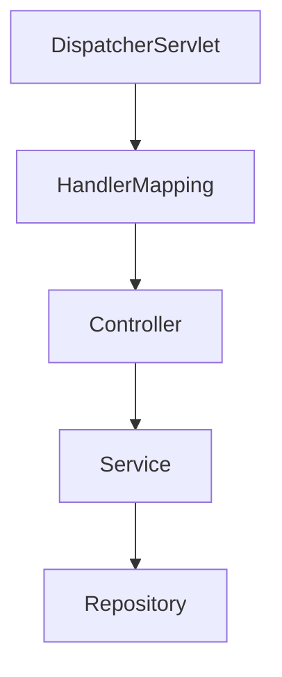

# 📘 Chapter 43 — Spring MVC Architecture

> 📂 File: `student-results-api-notes/06-SpringBoot/02-MVC.md`

Many developers know the term MVC, but they don't understand how it works internally.

This chapter should explain how Spring MVC converts an HTTP request into business logic and back into JSON.

It connects everything you've already covered:

Browser
Tomcat
DispatcherServlet
HandlerMapping
Controller
Service
Repository
Entity
DTO
Jackson

into one MVC architecture.

---

# 🌍 Introduction

So far we've followed an HTTP request through:

```text
Browser
    │
    ▼
Linux TCP Stack
    │
    ▼
Tomcat
    │
    ▼
DispatcherServlet
```

Now another important question appears:

> 🤔 **After DispatcherServlet receives the request, how is the application organized?**

Imagine your Student Results API receives:

```http
GET /students/1051110244
```

Eventually the browser receives:

```json
{
  "id":1051110244,
  "name":"Alice",
  "marks":95
}
```

How did Spring Boot generate this response?

The answer is:

# 🌱 Spring MVC

MVC stands for:

* 🟦 Model
* 🟨 View
* 🟩 Controller

In REST APIs, instead of rendering HTML views, the response is usually **JSON**.

---

## Mermaid Snapshot (From deep-dive)



# 🎯 Learning Objectives

After completing this chapter you will understand:

* 🌱 What MVC is
* 🎮 Controller
* ⚙️ Service
* 🗄️ Repository
* 📦 Model
* 📄 DTO
* 🔄 Complete request lifecycle
* 🧩 Layer responsibilities
* 🍃 Spring Boot MVC
* 🐳 Docker
* ☸️ Kubernetes
* 🧪 MVC debugging

---

# ❓ Why MVC?

Imagine placing everything inside one class.

```java
public class StudentController {

    public StudentResponse getStudent() {

        // SQL Query

        // Business Logic

        // JSON Creation

    }

}
```

Problems:

* ❌ Hard to maintain
* ❌ Hard to test
* ❌ Code duplication
* ❌ Tight coupling
* ❌ Difficult to extend

MVC separates responsibilities into layers.

---

# 🏗️ MVC Architecture

```text
                    Browser
                        │
                        ▼
                  HTTP Request
                        │
                        ▼
               DispatcherServlet
                        │
                        ▼
+---------------------------------------------+
|              Controller                     |
+---------------------------------------------+
                        │
                        ▼
+---------------------------------------------+
|               Service                       |
+---------------------------------------------+
                        │
                        ▼
+---------------------------------------------+
|             Repository                      |
+---------------------------------------------+
                        │
                        ▼
                  PostgreSQL
                        │
                        ▼
                  Student Entity
                        │
                        ▼
                  StudentResponse
                        │
                        ▼
                     JSON
                        │
                        ▼
                    Browser
```

Each layer has one primary responsibility.

---

# 🟩 Controller Layer

The Controller is the **entry point** for HTTP requests.

Example:

```java
@RestController
@RequestMapping("/students")
public class StudentController {

    @GetMapping("/{id}")
    public StudentResponse getStudent(
            @PathVariable Long id){

        return service.getStudent(id);

    }

}
```

Responsibilities:

* Receive HTTP requests
* Validate request format
* Read path variables
* Read query parameters
* Delegate to the Service layer
* Return the response

The Controller should contain very little business logic.

---

# ⚙️ Service Layer

The Service contains the application's business rules.

Example:

```java
@Service
public class StudentService {

    public StudentResponse getStudent(Long id){

        Student student =
            repository.findById(id);

        return mapper.toResponse(student);

    }

}
```

Responsibilities:

* Business rules
* Calculations
* Validation
* Transactions
* Calling multiple repositories
* Converting entities to DTOs

---

# 🗄️ Repository Layer

Repositories communicate with the database.

Example:

```java
@Repository
public interface StudentRepository
        extends JpaRepository<Student,Long>{
}
```

Responsibilities:

* SQL generation
* Database queries
* CRUD operations
* Entity persistence

Repositories should not contain business logic.

---

# 📦 Model Layer

The Model represents application data.

There are usually two kinds of models.

## 🏛️ Entity

Database representation.

```java
@Entity
public class Student {

    Long id;

    String name;

    int marks;

}
```

Maps directly to database tables.

---

## 📄 DTO (Data Transfer Object)

API representation.

```java
public class StudentResponse {

    Long id;

    String name;

    int marks;

}
```

DTOs define what the API exposes.

Never expose database entities directly unless appropriate.

---

# 🔄 Complete Request Flow

Suppose the browser sends:

```http
GET /students/1051110244
```

Execution:

```text
Browser

↓

DispatcherServlet

↓

StudentController

↓

StudentService

↓

StudentRepository

↓

Hibernate

↓

PostgreSQL

↓

Student Entity

↓

StudentResponse DTO

↓

Jackson

↓

JSON

↓

Browser
```

This is the complete MVC pipeline.

---

# 🍃 Student Results API Example

Project structure:

```text
student-results-api

├── controller

│      StudentController

├── service

│      StudentService

├── repository

│      StudentRepository

├── entity

│      Student

├── dto

│      StudentResponse

└── config
```

Each package has a clearly defined responsibility.

---

# 🧠 Layer Responsibilities

| Layer          | Responsibility       |
| -------------- | -------------------- |
| 🌐 Controller  | HTTP communication   |
| ⚙️ Service     | Business logic       |
| 🗄️ Repository | Database access      |
| 🏛️ Entity     | Database mapping     |
| 📄 DTO         | API response/request |
| 🗃️ Database   | Persistent storage   |

This separation makes applications easier to maintain and test.

---

# 🚫 Common Mistakes

## ❌ Business Logic Inside Controller

Bad:

```java
@GetMapping("/{id}")
public StudentResponse getStudent(){

    // Database query

    // Validation

    // Business rules

}
```

---

## ✅ Correct

```text
Controller

↓

Service

↓

Repository
```

Each layer performs only its own responsibility.

---

# 📊 Complete MVC Lifecycle

```text
HTTP Request
      │
      ▼
DispatcherServlet
      │
      ▼
Controller
      │
      ▼
Service
      │
      ▼
Repository
      │
      ▼
Hibernate
      │
      ▼
Database
      │
      ▼
Entity
      │
      ▼
DTO
      │
      ▼
Jackson
      │
      ▼
JSON Response
```

---

# 🐳 Docker Perspective

```text
Container

↓

Java Process

↓

Spring Boot

↓

Controller

↓

Service

↓

Repository
```

MVC architecture is unchanged inside containers.

---

# ☸️ Kubernetes Perspective

```text
Ingress

↓

Service

↓

Pod

↓

Tomcat

↓

Spring MVC

↓

Controller

↓

Service

↓

Repository
```

Kubernetes routes traffic to the Pod.

Spring MVC organizes request processing inside the application.

---

# 🧪 Hands-on Lab

## Start the Application

```bash
./mvnw spring-boot:run
```

---

## Call the API

```bash
curl http://localhost:8080/students/1051110244
```

Observe the JSON response returned through the MVC pipeline.

---

## Display Request Mappings

```bash
curl http://localhost:8080/actuator/mappings
```

Find the mapping for:

```text
StudentController#getStudent()
```

---

## Enable Spring MVC Logging

```properties
logging.level.org.springframework.web=DEBUG
```

Observe how DispatcherServlet routes requests to the controller.

---

## Debug the Request Flow

Set breakpoints in:

1. `StudentController#getStudent()`
2. `StudentService#getStudent()`
3. `StudentRepository#findById()`

Step through the request and observe the flow between layers.

---

# 📈 Complete MVC Architecture

```text
Browser
      │
      ▼
HTTP Request
      │
      ▼
Tomcat
      │
      ▼
DispatcherServlet
      │
      ▼
Controller
      │
      ▼
Service
      │
      ▼
Repository
      │
      ▼
Hibernate
      │
      ▼
PostgreSQL
      │
      ▼
Entity
      │
      ▼
DTO
      │
      ▼
Jackson
      │
      ▼
JSON
      │
      ▼
Browser
```

This is the complete Spring MVC request-processing architecture used by your Student Results API.

---

# 💡 Key Takeaways

✅ Spring MVC organizes applications into well-defined layers with clear responsibilities.

✅ Controllers handle HTTP communication and delegate work instead of containing business logic.

✅ Services implement business rules, validation, transactions, and orchestration.

✅ Repositories provide database access and interact with Hibernate/JPA.

✅ Entities represent persistent database objects, while DTOs represent API request and response models.

✅ DispatcherServlet coordinates the MVC pipeline, routing every request through the appropriate controller.

✅ This layered architecture improves maintainability, testability, scalability, and separation of concerns.

---

# ➡️ Next Chapter

📘 **`06-SpringBoot/03-IoC-Container.md`**

In the next chapter, we'll explore the heart of Spring Framework:

* 📦 What the IoC Container is
* 🧠 How `ApplicationContext` manages Beans
* 🔍 Component scanning
* ⚙️ Bean registration
* 💉 Dependency Injection
* 🔄 Bean lifecycle
* 🏗️ Singleton vs Prototype scope

By the end of the next chapter, you'll understand how Spring Boot automatically creates and wires every object in your application before the first HTTP request is processed.
