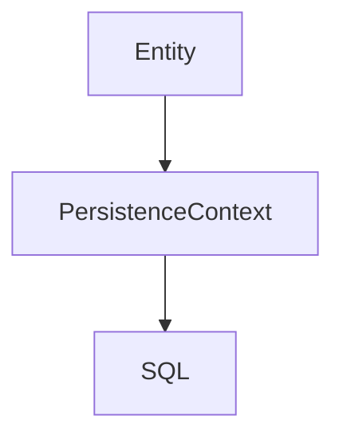

# 📘 Chapter 52 — Hibernate Entity

> 📂 File: `student-results-api-notes/07-Hibernate/01-Entity.md`

This chapter begins the Hibernate & JPA module.

Everything you've learned so far has explained how a request travels through:

Browser 🌐
Linux 🐧
Tomcat 🐱
Spring Boot 🌱
Controller 🎮
Service ⚙️
Repository 🗄️

Now we answer the next big question:

How does a Java object become a row in a PostgreSQL table?

The answer starts with the Entity.

An Entity is the foundation of Hibernate. Every other JPA concept—EntityManager, Persistence Context, Dirty Checking, Lazy Loading, Relationships, Transactions, Caching—builds on this chapter.

---

# 🌍 Introduction

In the previous module, we learned that the Repository communicates with the database using **Spring Data JPA**.

For example:

```java
Student student =
    repository.findById(id)
              .orElseThrow();
```

This raises an important question:

> 🤔 **How does Hibernate know that the `Student` Java class represents the `student` table in PostgreSQL?**

The answer is:

# 🏛️ Entity

An **Entity** is a Java object that Hibernate maps to a database table.

Without Entities, Hibernate would have no idea how Java objects relate to relational database tables.

---

## Mermaid Snapshot (From deep-dive)



# 🎯 Learning Objectives

After completing this chapter you will understand:

* 🏛️ What an Entity is
* 🗄️ Object Relational Mapping (ORM)
* 🏷️ `@Entity`
* 📋 `@Table`
* 🔑 `@Id`
* 🔢 Primary Keys
* 🆔 ID Generation Strategies
* 📝 `@Column`
* 🚫 Transient Fields
* ⚡ Entity Lifecycle
* 🐳 Docker
* ☸️ Kubernetes

---

# ❓ What Is an Entity?

An Entity is a **Java object that represents one row in a database table**.

Think of it like this:

```text
Java Object
        │
        ▼
Hibernate ORM
        │
        ▼
Database Table
```

Each object corresponds to one record.

Example:

```text
Student Object

↓

Student Table

↓

One Row
```

---

# 🌉 What Is ORM?

ORM stands for:

# 🗄️ Object Relational Mapping

It connects:

```text
Java World
────────────────────

Class

Object

Field

Method

↓

Hibernate ORM

↓

Relational Database
────────────────────

Table

Row

Column

Record
```

Instead of writing SQL manually, Hibernate translates Java objects into SQL statements.

---

# 🏗️ Entity Architecture

```text
Browser
      │
      ▼
Controller
      │
      ▼
Service
      │
      ▼
Repository
      │
      ▼
Hibernate
      │
      ▼
+-----------------------------+
|      Student Entity         |
+-----------------------------+
      │
      ▼
PostgreSQL
```

The Entity is the bridge between Java and the database.

---

# 🏷️ @Entity Annotation

Every persistent class must be annotated with:

```java
@Entity
public class Student {

}
```

This tells Hibernate:

> "Manage this class as a database entity."

Without `@Entity`, Hibernate ignores the class.

---

# 📋 @Table Annotation

By default, Hibernate uses the class name as the table name.

You can customize it:

```java
@Entity
@Table(name = "student")
public class Student {

}
```

Mapping:

```text
Java Class

Student

↓

Database Table

student
```

---

# 🔑 Primary Key

Every Entity requires a primary key.

```java
@Id
private Long id;
```

Mapping:

```text
Java Field

id

↓

Database Column

PRIMARY KEY
```

Hibernate uses the primary key to uniquely identify every Entity.

---

# 🆔 ID Generation

Hibernate can generate IDs automatically.

```java
@Id
@GeneratedValue(strategy = GenerationType.IDENTITY)
private Long id;
```

Common strategies:

| Strategy      | Description                    |
| ------------- | ------------------------------ |
| 🆔 `IDENTITY` | Database auto-increment        |
| 🔢 `SEQUENCE` | Database sequence              |
| 📋 `TABLE`    | Separate table stores IDs      |
| ⚙️ `AUTO`     | Hibernate chooses the strategy |

For PostgreSQL, `IDENTITY` or `SEQUENCE` are the most common.

---

# 📝 @Column Annotation

Each field maps to a database column.

```java
@Column(name = "student_name")
private String name;
```

Mapping:

```text
Java Field

name

↓

Database Column

student_name
```

Additional options:

```java
@Column(
    nullable = false,
    unique = true,
    length = 100
)
private String email;
```

---

# 📦 Complete Entity Example

```java
@Entity
@Table(name = "student")
public class Student {

    @Id
    @GeneratedValue(strategy = GenerationType.IDENTITY)
    private Long id;

    @Column(nullable = false)
    private String name;

    @Column(nullable = false)
    private Integer marks;

    @Column(unique = true)
    private String rollNumber;

}
```

Hibernate now knows exactly how to map this class to the database.

---

# 🔄 Entity Lifecycle

An Entity moves through several states.

```text
New Object
      │
      ▼
Transient
      │
      ▼
persist()
      │
      ▼
Managed
      │
      ▼
commit()
      │
      ▼
Database Row
      │
      ▼
detach()
      │
      ▼
Detached
      │
      ▼
remove()
      │
      ▼
Removed
```

We'll explore these states in detail in later chapters.

---

# 🍃 Student Results API Example

Suppose PostgreSQL contains:

| id | name  | marks |
| -- | ----- | ----: |
| 1  | Alice |    95 |

Hibernate converts this row into:

```java
Student student = new Student();

student.setId(1L);
student.setName("Alice");
student.setMarks(95);
```

Your Service works with Java objects—not SQL result sets.

---

# 🧠 Entity vs DTO

This is one of the most important distinctions.

```text
Database

↓

Entity

↓

Service

↓

DTO

↓

JSON

↓

Browser
```

| Entity 🏛️                    | DTO 📦                   |
| ----------------------------- | ------------------------ |
| Represents database           | Represents API           |
| Managed by Hibernate          | Managed by application   |
| Maps to table                 | Maps to request/response |
| Contains persistence metadata | Contains transfer data   |

Never confuse the two.

---

# 🚫 Transient Fields

Sometimes a field should **not** be stored in the database.

```java
@Transient
private String temporaryMessage;
```

Hibernate ignores this field.

Useful for:

* Calculated values
* Temporary data
* UI-only information

---

# 📈 Complete Persistence Flow

Suppose the browser creates a student.

```http
POST /students
```

Flow:

```text
Browser
      │
      ▼
StudentRequest DTO
      │
      ▼
Controller
      │
      ▼
Service
      │
      ▼
Student Entity
      │
      ▼
Repository
      │
      ▼
Hibernate
      │
      ▼
INSERT INTO student ...
      │
      ▼
PostgreSQL
```

When retrieving data:

```text
PostgreSQL
      │
      ▼
SELECT *
      │
      ▼
Hibernate
      │
      ▼
Student Entity
      │
      ▼
Service
      │
      ▼
StudentResponse DTO
      │
      ▼
JSON
```

---

# 🚫 Common Mistakes

## ❌ Forgetting @Entity

```java
public class Student {

}
```

Hibernate ignores this class.

---

## ❌ Missing Primary Key

```java
@Entity
public class Student {

    private String name;

}
```

Every Entity **must** have an `@Id`.

---

## ❌ Returning Entity Directly

```java
return student;
```

Instead:

```text
Entity

↓

DTO

↓

JSON
```

Entities belong to the persistence layer—not the API layer.

---

# 🐳 Docker Perspective

```text
Docker Container
        │
        ▼
Spring Boot
        │
        ▼
Hibernate
        │
        ▼
Student Entity
        │
        ▼
PostgreSQL Container
```

Hibernate performs the same Entity mapping regardless of whether the database runs locally or in another container.

---

# ☸️ Kubernetes Perspective

```text
Pod
 │
 ▼
Spring Boot
 │
 ▼
Hibernate
 │
 ▼
Student Entity
 │
 ▼
PostgreSQL Service
 │
 ▼
Database Pod
```

Entities are JVM objects. Kubernetes only provides the infrastructure that hosts the application and database.

---

# 🧪 Hands-on Lab

## Create an Entity

```java
@Entity
@Table(name = "student")
public class Student {

    @Id
    @GeneratedValue(strategy = GenerationType.IDENTITY)
    private Long id;

    private String name;

    private Integer marks;

}
```

Start the application and verify that Hibernate recognizes the Entity.

---

## Enable SQL Logging

```properties
spring.jpa.show-sql=true
spring.jpa.properties.hibernate.format_sql=true
```

Observe SQL generated when saving or retrieving Entities.

---

## Save an Entity

```java
Student student = new Student();

student.setName("Alice");
student.setMarks(95);

repository.save(student);
```

Watch Hibernate generate an `INSERT` statement.

---

## Retrieve an Entity

```java
Student student =
    repository.findById(1L)
              .orElseThrow();
```

Observe Hibernate execute a `SELECT` and populate the Java object.

---

## Experiment with @Transient

```java
@Transient
private String message;
```

Restart the application and verify that no corresponding database column is created.

---

# 📈 Complete Entity Flow

```text
Java Class
      │
      ▼
@Entity
      │
      ▼
Hibernate Metadata
      │
      ▼
EntityManager
      │
      ▼
Persistence Context
      │
      ▼
SQL Generation
      │
      ▼
JDBC Driver
      │
      ▼
PostgreSQL
      │
      ▼
Database Row
```

This is the foundation of Hibernate's Object Relational Mapping.

---

# 💡 Key Takeaways

✅ An Entity is a Java class that represents a database table.

✅ `@Entity` marks a class as persistent, while `@Table` customizes the table mapping.

✅ Every Entity must have a primary key annotated with `@Id`.

✅ `@GeneratedValue` controls how primary keys are generated.

✅ `@Column` customizes column names and constraints such as `nullable`, `unique`, and `length`.

✅ Hibernate automatically converts Entities into SQL statements and SQL results back into Java objects.

✅ Entities belong to the persistence layer, while DTOs belong to the API layer.

---

# ➡️ Next Chapter

📘 **`07-Hibernate/02-Hibernate-Architecture.md`**

In the next chapter, we'll look inside Hibernate itself.

We'll answer questions such as:

* 🏗️ What is Hibernate's internal architecture?
* 🧠 What is the `EntityManager`?
* 📦 What is the Persistence Context?
* 🔄 How does Hibernate track object changes?
* ⚡ What is Dirty Checking?
* 🗄️ How does Hibernate generate SQL automatically?

By the end of the next chapter, you'll understand what happens internally after you call:

```java
repository.save(student);
```

and how Hibernate transforms that single method call into efficient SQL executed against PostgreSQL.
