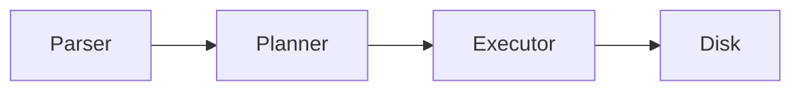

# 📘 Chapter 59 — PostgreSQL Architecture

> 📂 File: `student-results-api-notes/08-PostgreSQL/01-Architecture.md`

This chapter starts the PostgreSQL module.

Until now, you've followed the request from:

Browser 🌐
Linux 🐧
JVM ☕
Tomcat 🐱
Spring Boot 🌱
Hibernate 🏛️

Now we continue the journey into the database engine itself.

This chapter answers:

What happens after Hibernate sends SQL through JDBC?

It introduces PostgreSQL's internal architecture before diving into connections, processes, storage, MVCC, WAL, indexing, and query execution.

---

# 🌍 Introduction

In the previous module, we learned how Hibernate converts Java objects into SQL statements.

Example:

```java id="7m0jpx"
Student student =
repository.findById(1L)
          .orElseThrow();
```

Hibernate generated:

```sql id="uzq15v"
SELECT *
FROM student
WHERE id = 1;
```

The SQL statement is sent through:

```text id="6v8lhq"
Hibernate

↓

JDBC Driver

↓

TCP Socket

↓

PostgreSQL
```

This raises an important question:

> 🤔 **What happens after PostgreSQL receives the SQL query?**

To answer that, we first need to understand PostgreSQL's internal architecture.

---

## Mermaid Snapshot (From deep-dive)



# 🎯 Learning Objectives

After completing this chapter you will understand:

* 🐘 PostgreSQL Architecture
* 🔌 Client Connections
* ⚙️ PostgreSQL Processes
* 💾 Shared Memory
* 📂 Data Files
* 📒 Write-Ahead Log (WAL)
* 📦 Buffer Cache
* 🔄 Query Execution Flow
* 🐳 Docker
* ☸️ Kubernetes

---

# ❓ What Is PostgreSQL?

PostgreSQL is an **Open Source Relational Database Management System (RDBMS)**.

It is responsible for:

* Storing data
* Executing SQL
* Managing transactions
* Enforcing constraints
* Recovering after crashes
* Optimizing queries

Unlike Hibernate, PostgreSQL does **not** understand Java objects.

It understands SQL.

---

# 🏗️ High-Level Architecture

```text id="6sb0cw"
Spring Boot
      │
      ▼
Hibernate
      │
      ▼
JDBC Driver
      │
      ▼
TCP Socket
      │
      ▼
+--------------------------------------+
|           PostgreSQL                 |
|--------------------------------------|
| Connection Manager                   |
| Query Parser                         |
| Planner / Optimizer                  |
| Executor                             |
| Buffer Manager                       |
| WAL Manager                          |
| Storage Engine                       |
+--------------------------------------+
      │
      ▼
Data Files
```

Each component has a specific responsibility.

---

# 🌐 Complete Request Journey

Suppose the browser requests:

```http id="o7o6a7"
GET /students/1
```

Execution:

```text id="17qjot"
Browser
      │
      ▼
Spring Boot
      │
      ▼
Hibernate
      │
      ▼
SQL
      │
      ▼
JDBC
      │
      ▼
PostgreSQL
      │
      ▼
Parse SQL
      │
      ▼
Create Execution Plan
      │
      ▼
Read Data Pages
      │
      ▼
Return Rows
      │
      ▼
Hibernate
      │
      ▼
Entity
      │
      ▼
JSON
```

This is the complete application-to-database path.

---

# 🔌 Client Connections

Applications connect using TCP.

```text id="8ez6xy"
Spring Boot
      │
      ▼
TCP Port 5432
      │
      ▼
PostgreSQL Server
```

Each client connection is authenticated before SQL can be executed.

---

# ⚙️ PostgreSQL Processes

Unlike many databases, PostgreSQL creates a **backend process** for each client connection.

```text id="95by8h"
PostgreSQL
│
├── Postmaster
│
├── Backend Process (Client 1)
│
├── Backend Process (Client 2)
│
├── Backend Process (Client 3)
│
├── WAL Writer
│
├── Checkpointer
│
├── Background Writer
│
└── Autovacuum
```

Each backend process executes SQL independently.

---

# 🧠 Shared Memory

All backend processes share common memory.

```text id="8iim1m"
+----------------------------+
|      Shared Memory         |
|----------------------------|
| Shared Buffers             |
| WAL Buffers                |
| Lock Tables                |
| Transaction Status         |
+----------------------------+
```

Shared memory avoids repeatedly reading the same data from disk.

---

# 📦 Shared Buffers

Shared Buffers act as PostgreSQL's main cache.

```text id="6t6yzo"
Disk

↓

Shared Buffers

↓

SQL Query
```

If a requested page already exists in Shared Buffers:

```text id="zw9vhp"
Cache Hit

↓

No Disk Read
```

Otherwise:

```text id="69f4b2"
Cache Miss

↓

Read From Disk
```

---

# 📂 Storage Engine

Database data is stored on disk.

```text id="7n9i8z"
Database

↓

Tables

↓

Pages

↓

Disk Files
```

Example:

```text id="saznci"
student

↓

student.dat
```

PostgreSQL stores table data in fixed-size pages (typically **8 KB**).

---

# 📒 Write-Ahead Log (WAL)

Before modifying data files:

```text id="p9i1zy"
UPDATE

↓

Write WAL

↓

Write Data File
```

This guarantees durability.

If PostgreSQL crashes:

```text id="m3o1cp"
Restart

↓

Replay WAL

↓

Recover Database
```

WAL is the foundation of crash recovery and replication.

---

# 🔍 Query Parser

Suppose PostgreSQL receives:

```sql id="utx3u3"
SELECT *
FROM student
WHERE id = 1;
```

The parser checks:

* SQL syntax
* Table names
* Column names
* Permissions

If the SQL is invalid, execution stops immediately.

---

# 📈 Query Planner

The Planner decides the most efficient way to execute the query.

Example:

```text id="q6c97s"
Use Primary Key Index?

OR

Scan Entire Table?
```

Its goal is to minimize execution cost.

---

# ⚡ Query Executor

After planning:

```text id="pvw7fd"
Execution Plan

↓

Read Pages

↓

Apply Filters

↓

Return Rows
```

The Executor retrieves the requested data and sends it back to the client.

---

# 🍃 Student Results API Example

Suppose:

```java id="rq9q7z"
repository.findById(1L);
```

Hibernate sends:

```sql id="sqhn0j"
SELECT *
FROM student
WHERE id = 1;
```

PostgreSQL performs:

```text id="8kqiwl"
Receive SQL

↓

Parse

↓

Optimize

↓

Read Buffer

↓

Disk (if needed)

↓

Return Row

↓

Hibernate
```

The Java application never interacts with storage files directly.

---

# 🧠 PostgreSQL Internal Components

```text id="my3tcg"
Client
   │
   ▼
Postmaster
   │
   ▼
Backend Process
   │
   ▼
Parser
   │
   ▼
Planner
   │
   ▼
Executor
   │
   ▼
Shared Buffers
   │
   ▼
Storage Engine
```

This is the internal request pipeline.

---

# 🚫 Common Mistakes

## ❌ Assuming SQL Reads Directly From Disk

Most queries are served from **Shared Buffers**.

Disk access happens only when the required page is not already cached.

---

## ❌ Ignoring the Query Planner

Developers often focus only on SQL syntax.

The execution plan frequently has a greater impact on performance than the SQL text itself.

---

## ❌ Forgetting WAL

Database modifications are not written directly to table files first.

WAL is written before data pages to ensure durability and crash recovery.

---

# 🐳 Docker Perspective

```text id="9rj98l"
Spring Boot Container
         │
         ▼
TCP Port 5432
         │
         ▼
PostgreSQL Container
         │
         ▼
Shared Buffers
         │
         ▼
Volume
```

Docker containers isolate processes, but PostgreSQL's internal architecture remains unchanged.

---

# ☸️ Kubernetes Perspective

```text id="t8ck1z"
Spring Boot Pod
        │
        ▼
Service
        │
        ▼
PostgreSQL Pod
        │
        ▼
Persistent Volume
```

The database stores its files on a Persistent Volume so data survives Pod restarts.

---

# 🧪 Hands-on Lab

## Connect to PostgreSQL

```bash id="vcpv8z"
psql -U postgres
```

Verify that you can connect to the server.

---

## View Running Processes

```sql id="9x5ut5"
SELECT pid,
       usename,
       state
FROM pg_stat_activity;
```

Observe one backend process for each active client connection.

---

## Inspect Database Size

```sql id="kfz2g9"
SELECT pg_size_pretty(
    pg_database_size(current_database())
);
```

Measure the storage used by the current database.

---

## View Execution Plan

```sql id="l7e6ja"
EXPLAIN
SELECT *
FROM student
WHERE id = 1;
```

Observe whether PostgreSQL chooses an index scan or a sequential scan.

---

## Monitor Buffer Usage

Enable the `pg_buffercache` extension and inspect which table pages are currently cached in Shared Buffers.

---

# 📈 Complete PostgreSQL Request Flow

```text id="7zw6eh"
Hibernate
      │
      ▼
JDBC Driver
      │
      ▼
TCP Socket
      │
      ▼
PostgreSQL
      │
      ▼
Connection Manager
      │
      ▼
Parser
      │
      ▼
Planner
      │
      ▼
Executor
      │
      ▼
Shared Buffers
      │
      ▼
Storage Engine
      │
      ▼
Disk
      │
      ▼
Rows Returned
      │
      ▼
Hibernate
```

This is the complete architecture behind every SQL statement executed by your Spring Boot application.

---

# 📊 PostgreSQL Component Summary

| Component              | Responsibility                               |
| ---------------------- | -------------------------------------------- |
| 🌐 Connection Manager  | Accepts and authenticates client connections |
| ⚙️ Backend Process     | Executes SQL for one client connection       |
| 📝 Parser              | Validates SQL syntax and object names        |
| 📈 Planner / Optimizer | Chooses the most efficient execution plan    |
| ⚡ Executor             | Executes the selected plan                   |
| 📦 Shared Buffers      | Caches table and index pages in memory       |
| 📒 WAL                 | Ensures durability and crash recovery        |
| 💽 Storage Engine      | Reads and writes database files on disk      |

---

# 💡 Key Takeaways

✅ PostgreSQL is a relational database engine that executes SQL and manages persistent data.

✅ Client applications communicate with PostgreSQL over TCP, typically using port **5432**.

✅ PostgreSQL creates a dedicated backend process for each client connection.

✅ Shared Buffers cache frequently accessed pages, reducing expensive disk I/O.

✅ Every SQL statement passes through the Parser, Planner, and Executor before accessing storage.

✅ The Write-Ahead Log (WAL) guarantees durability by recording changes before updating data files.

✅ Understanding PostgreSQL's architecture provides the foundation for learning storage, indexing, query optimization, transactions, and performance tuning.

---

# ➡️ Next Chapter

📘 **`08-PostgreSQL/02-Connection-Lifecycle.md`**

In the next chapter, we'll follow a database connection from creation to termination.

We'll explore:

* 🔌 JDBC connection establishment
* 🤝 PostgreSQL authentication
* 👤 Backend process creation
* 🧠 Session state
* 📦 Connection pooling with HikariCP
* 🔄 Connection reuse
* ❌ Connection termination

By the end of the next chapter, you'll understand what actually happens after Spring Boot calls:

```java
dataSource.getConnection();
```

and how that single method results in a live PostgreSQL backend process ready to execute SQL.
