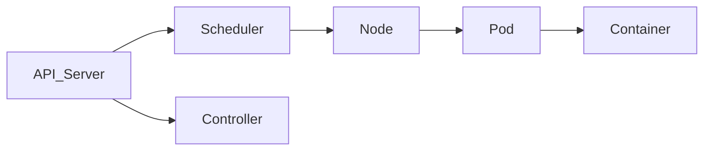

# 📘 Chapter 78 — Kubernetes Architecture

> 📂 File: `student-results-api-notes/10-Kubernetes/01-Kubernetes-Architecture.md`

This chapter begins the Kubernetes module, and it connects everything you've learned so far into one complete system.

Until now you've learned:

🌐 Networking (TCP/IP, DNS, HTTP)
🐧 Linux (Processes, Memory, Sockets)
☕ JVM
🐱 Tomcat
🌱 Spring Boot
🏛️ Hibernate
🐘 PostgreSQL
🐳 Docker (Images, Containers, Namespaces, cgroups, Networking)

Now another important question appears:

Who starts, monitors, scales, replaces, and manages all of these containers in production?

For example:

What happens if a container crashes?
How are hundreds of containers distributed across multiple servers?
How do rolling updates happen without downtime?
How does a Service always find the correct Pod?
How does Kubernetes know where to schedule a Pod?

The answer is:

Kubernetes

This chapter introduces the complete Kubernetes architecture from the control plane down to the Linux process level. It serves as the foundation for every Kubernetes concept that follows.

---

# 🌍 Introduction

In the previous modules, we learned how a Spring Boot application becomes a Linux process running inside a Docker container.

The journey looked like this:

```text
Browser
    │
    ▼
Network
    │
    ▼
Linux
    │
    ▼
JVM
    │
    ▼
Tomcat
    │
    ▼
Spring Boot
    │
    ▼
Hibernate
    │
    ▼
PostgreSQL
    │
    ▼
Docker Container
```

But another important question appears:

> 🤔 **Who creates and manages thousands of Docker containers across hundreds of servers?**

Who:

* Restarts failed containers?
* Schedules containers onto machines?
* Performs rolling updates?
* Scales applications?
* Provides service discovery?

The answer is:

# ☸️ Kubernetes

Kubernetes is a container orchestration platform.

It automates deployment, scaling, networking, recovery, and lifecycle management of containerized applications.

---

## Mermaid Snapshot (From deep-dive)



# 🎯 Learning Objectives

After completing this chapter you will understand:

* ☸️ What Kubernetes is
* 🏗️ Kubernetes Architecture
* 🧠 Control Plane
* 🖥️ Worker Nodes
* 📡 API Server
* 📋 etcd
* 🎯 Scheduler
* 🔄 Controller Manager
* ⚙️ kubelet
* 📦 Container Runtime
* 🌐 kube-proxy

---

# ❓ Why Do We Need Kubernetes?

Suppose we manually run:

```bash
docker run student-api
```

Problems:

* If the container crashes, someone must restart it.
* If the server crashes, the application becomes unavailable.
* Scaling to 100 containers is difficult.
* Load balancing must be configured manually.
* Deployments require manual coordination.

Production environments need automation.

---

# 🏗️ High-Level Kubernetes Architecture

```text
                    Kubernetes Cluster

        +--------------------------------------+

              Control Plane

        +--------------------------------------+

          │            │             │

          ▼            ▼             ▼

     Worker Node   Worker Node   Worker Node
```

The cluster is divided into:

* Control Plane
* Worker Nodes

---

# 🧠 Control Plane

The Control Plane makes decisions for the cluster.

It contains:

```text
API Server

Scheduler

Controller Manager

etcd
```

Think of it as the "brain" of Kubernetes.

---

# 🖥️ Worker Nodes

Worker Nodes execute application workloads.

Each node contains:

```text
kubelet

Container Runtime

kube-proxy

Pods
```

Applications never run on the Control Plane.

They run on Worker Nodes.

---

# 📡 API Server

The API Server is the front door of Kubernetes.

Every request goes through it.

Example:

```bash
kubectl apply -f deployment.yaml
```

Flow:

```text
kubectl

↓

API Server
```

The API Server:

* Validates requests
* Authenticates users
* Stores objects in etcd
* Notifies controllers

---

# 📋 etcd

etcd is Kubernetes' distributed key-value database.

It stores:

* Deployments
* Pods
* Services
* ConfigMaps
* Secrets
* Node information

Architecture:

```text
API Server

↓

etcd

↓

Cluster State
```

If etcd is lost, the cluster loses its desired state.

---

# 🎯 Scheduler

Suppose a Deployment requests:

```yaml
replicas: 3
```

Initially:

```text
Pod

↓

No Node Assigned
```

The Scheduler decides:

```text
Pod 1 → Worker A

Pod 2 → Worker B

Pod 3 → Worker C
```

It considers:

* Available CPU
* Available Memory
* Node taints
* Affinity rules
* Resource requests

---

# 🔄 Controller Manager

Controllers continuously compare:

```text
Desired State

↓

Actual State
```

Example:

Desired:

```text
3 Pods
```

Actual:

```text
2 Pods
```

Controller action:

```text
Create New Pod
```

Controllers work continuously to reconcile the cluster state.

---

# ⚙️ kubelet

Every Worker Node runs a kubelet.

Responsibilities:

* Watches the API Server
* Starts Pods
* Stops Pods
* Monitors container health
* Reports node status

Flow:

```text
API Server

↓

kubelet

↓

Container Runtime

↓

Container
```

---

# 📦 Container Runtime

The container runtime creates containers.

Examples:

* containerd
* CRI-O

Flow:

```text
kubelet

↓

Container Runtime

↓

runc

↓

Linux Process
```

Eventually your application becomes a normal Linux process.

---

# 🌐 kube-proxy

kube-proxy manages Service networking.

Example:

```text
Client

↓

Service

↓

Pod A

Pod B

Pod C
```

It configures Linux networking rules so Services can distribute traffic to healthy Pods.

---

# 🍃 Student Results API Example

Suppose:

```yaml
Deployment

Replicas: 3
```

Execution:

```text
kubectl apply

↓

API Server

↓

etcd

↓

Scheduler

↓

Worker Node

↓

kubelet

↓

containerd

↓

Spring Boot Container
```

Eventually:

```text
Java Process

↓

Tomcat

↓

Student Results API
```

---

# 📊 Complete Kubernetes Architecture

```text
                    Developer
                        │
                        ▼
                  kubectl apply
                        │
                        ▼
                  API Server
                        │
          ┌─────────────┼─────────────┐
          ▼             ▼             ▼
        etcd      Scheduler    Controller Manager
                        │
                        ▼
                 Worker Node
                        │
                 kubelet
                        │
                Container Runtime
                        │
                      runc
                        │
                  Linux Kernel
                        │
                   Java Process
```

---

# 🔄 Desired State Model

Traditional systems:

```text
Administrator

↓

Start Container
```

Kubernetes:

```text
Desired State

↓

Controller

↓

Actual State
```

If the actual state changes unexpectedly, Kubernetes restores it automatically.

---

# 🚫 Common Mistakes

## ❌ Thinking Kubernetes Runs Containers

Kubernetes does not run containers directly.

The container runtime (such as containerd) creates containers.

---

## ❌ Thinking kubectl Talks to Worker Nodes

`kubectl` communicates only with the API Server.

Worker Nodes never receive direct commands from `kubectl`.

---

## ❌ Thinking the Scheduler Starts Pods

The Scheduler only selects a node.

The kubelet on that node starts the Pod.

---

# 🐳 Relationship with Docker

```text
Docker

↓

Creates Containers

----------------------

Kubernetes

↓

Manages Containers
```

Docker (or another container runtime) provides execution.

Kubernetes provides orchestration.

---

# 🧪 Hands-on Lab

## View Cluster Nodes

```bash
kubectl get nodes -o wide
```

Observe:

* Node names
* Roles
* Internal IPs
* Kubernetes version

---

## View System Pods

```bash
kubectl get pods -n kube-system
```

Identify components such as:

* CoreDNS
* kube-proxy
* etc.

---

## View Cluster Information

```bash
kubectl cluster-info
```

Locate the API Server endpoint.

---

## Inspect a Node

```bash
kubectl describe node <node-name>
```

Observe:

* Capacity
* Allocatable resources
* Conditions
* Running Pods

---

## Observe kubelet

On a Worker Node:

```bash
ps -ef | grep kubelet
```

Verify that kubelet is running as a Linux process.

---

# 📈 Complete Cluster Flow

```text
Developer
    │
    ▼
kubectl
    │
    ▼
API Server
    │
    ▼
etcd
    │
    ▼
Scheduler
    │
    ▼
Controller Manager
    │
    ▼
Worker Node
    │
    ▼
kubelet
    │
    ▼
containerd
    │
    ▼
runc
    │
    ▼
Linux Kernel
    │
    ▼
Java Process
    │
    ▼
Spring Boot
```

This is the complete architecture of a Kubernetes-managed application.

---

# 📊 Kubernetes Components

| Component             | Responsibility                                       |
| --------------------- | ---------------------------------------------------- |
| 📡 API Server         | Entry point for all Kubernetes operations            |
| 📋 etcd               | Stores the desired and current cluster state         |
| 🎯 Scheduler          | Selects the best node for unscheduled Pods           |
| 🔄 Controller Manager | Continuously reconciles desired and actual state     |
| ⚙️ kubelet            | Manages Pods and containers on a worker node         |
| 📦 Container Runtime  | Creates and manages containers                       |
| 🌐 kube-proxy         | Implements Service networking and traffic forwarding |
| 🖥️ Worker Node       | Runs application Pods                                |

---

# 💡 Key Takeaways

✅ Kubernetes is a container orchestration platform that automates deployment, scaling, recovery, and networking.

✅ The Control Plane manages the cluster through the API Server, etcd, Scheduler, and Controller Manager.

✅ Worker Nodes run applications using kubelet, a container runtime, and kube-proxy.

✅ Every Kubernetes operation begins with the API Server, which stores cluster state in etcd.

✅ The Scheduler chooses where Pods should run, while kubelet starts them using the container runtime.

✅ Kubernetes continuously reconciles the actual cluster state with the desired state stored in etcd.

✅ At the lowest level, every Kubernetes Pod ultimately becomes one or more Linux processes created by the container runtime.

---

# ➡️ Next Chapter

📘 **`10-Kubernetes/02-kubectl-to-Pod.md`**

In the next chapter, we'll trace the **complete lifecycle of a Pod** from the moment you execute:

```bash
kubectl apply -f deployment.yaml
```

We'll follow every step through:

* 📡 API Server
* 📋 etcd
* 🎯 Scheduler
* 🔄 Controller Manager
* ⚙️ kubelet
* 📦 containerd
* 🏃 runc
* 🐧 Linux kernel
* 🚀 Spring Boot process

By the end of the next chapter, you'll understand the complete end-to-end journey from a YAML manifest to a running Linux process inside a Kubernetes Pod.
