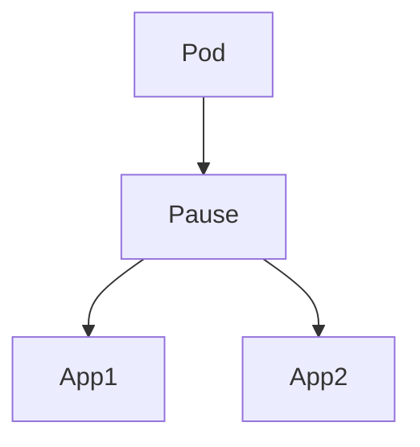

# 📘 Chapter 85 — Kubernetes Pod

> 📂 File: `student-results-api-notes/10-Kubernetes/08-Pod.md`

This chapter explains the most fundamental Kubernetes object.

Everything in Kubernetes eventually revolves around the Pod.

You've already learned the complete infrastructure:

API Server
    ↓
etcd
    ↓
Scheduler
    ↓
Controller Manager
    ↓
kubelet
    ↓
containerd
    ↓
runc
    ↓
Linux Process

Now another important question appears:

Why doesn't Kubernetes schedule containers directly?

Why is there another layer called Pod?

Why do we write:

kind: Pod

instead of:

kind: Container

The answer is that a Pod is much more than a container.

A Pod provides:

Shared Network Namespace
Shared IP Address
Shared localhost
Shared Volumes
Shared IPC Namespace
Shared UTS Namespace
Pod Sandbox
Pause Container

A container is merely a process.

A Pod is the execution environment that hosts one or more containers.

This chapter explains Pods from Kubernetes YAML all the way down to Linux namespaces

---

## Mermaid Snapshot (From deep-dive)



# 🌍 Introduction

In the previous chapter, we learned how kubelet uses the container runtime to create Linux containers.

The flow looked like this:

```text
kubelet

↓

containerd

↓

runc

↓

Linux Process
```

But another important question appears:

> 🤔 **Why doesn't Kubernetes create containers directly?**

Instead we always create:

```yaml
kind: Pod
```

Why?

Because Kubernetes schedules **Pods**, not individual containers.

A Pod is the smallest deployable unit in Kubernetes.

---

# 🎯 Learning Objectives

After completing this chapter you will understand:

* 📦 What a Pod is
* 🧩 Why Pods exist
* 🏠 Pod Sandbox
* ⏸️ Pause Container
* 🌐 Shared Network Namespace
* 📂 Shared Volumes
* 🔗 Inter-container Communication
* 📡 Pod IP
* 🐳 Pod vs Container
* ☸️ Complete Pod Architecture

---

# ❓ What Is a Pod?

A Pod is a group of one or more containers that share the same execution environment.

A Pod provides:

* Shared network
* Shared storage
* Shared IPC
* Shared hostname
* Shared lifecycle

Containers inside a Pod cooperate as a single logical application.

---

# 🏗️ High-Level Architecture

```text
                 Pod

+--------------------------------+

 Pause Container

--------------------------------

 Spring Boot

--------------------------------

 Fluent Bit

--------------------------------

 Istio Proxy

+--------------------------------+
```

Every application container joins the Pod's shared environment.

---

# 🌐 Shared Network Namespace

Every Pod receives:

* One IP address
* One network namespace

Example:

```text
Pod IP

10.244.1.15
```

Containers:

```text
Spring Boot

↓

10.244.1.15

-------------------

Fluent Bit

↓

10.244.1.15
```

All containers use the same Pod IP.

---

# 🖥️ Shared localhost

Because containers share the same network namespace:

```text
Spring Boot

↓

localhost:8080

-------------------

Fluent Bit

↓

localhost:8080
```

Containers communicate through `localhost`.

This is impossible between containers in different Pods.

---

# 📂 Shared Volumes

Pod:

```yaml
volumes:
```

Containers:

```yaml
volumeMounts:
```

Architecture:

```text
Pod

↓

Shared Volume

↓

Container A

Container B
```

Both containers can read and write the same files.

---

# 🏠 Pod Sandbox

Before application containers start:

```text
RunPodSandbox()

↓

Pause Container
```

The sandbox owns:

* Network namespace
* IPC namespace
* UTS namespace

Application containers join these namespaces.

---

# ⏸️ Pause Container

Every Pod starts with a tiny pause container.

Responsibilities:

* Own Pod network namespace
* Own IPC namespace
* Own UTS namespace
* Keep namespaces alive

Example:

```text
Pod

├── Pause

├── Spring Boot

└── Fluent Bit
```

The pause container usually does no application work.

---

# 🔗 Why Multiple Containers?

Example:

```text
Student Results API Pod

├── Spring Boot

├── Fluent Bit

└── Metrics Exporter
```

Each container has a different responsibility:

* Business logic
* Log shipping
* Metrics collection

Yet they share the same Pod environment.

This pattern is called the **sidecar pattern**.

---

# 📡 Pod IP

Every Pod gets one IP.

Example:

```text
10.244.1.20
```

Inside the Pod:

```text
Spring Boot

↓

10.244.1.20

-----------------

Istio

↓

10.244.1.20
```

Different Pods receive different IPs.

---

# 🍃 Student Results API Example

Pod:

```text
student-api Pod

↓

Pause Container

↓

Spring Boot Container

↓

Fluent Bit Container
```

Communication:

```text
Fluent Bit

↓

localhost

↓

Spring Boot
```

No external networking is required because both containers share the Pod network namespace.

---

# 📊 Pod Architecture

```text
                    Pod

+------------------------------------------------+

 Pause Container

   │

   ├──────── Network Namespace

   ├──────── IPC Namespace

   ├──────── UTS Namespace

   │

-----------------------------------------------

 Spring Boot Container

-----------------------------------------------

 Fluent Bit Container

-----------------------------------------------

 Metrics Container

+------------------------------------------------+
```

---

# 🐧 Linux View

Eventually the Pod becomes:

```text
Pause Process

↓

Java Process

↓

Fluent Bit Process
```

Each is a Linux process.

The pause process owns the shared namespaces.

---

# 📦 Pod Lifecycle

Creation:

```text
Pending

↓

Scheduled

↓

ContainerCreating

↓

Running
```

Deletion:

```text
Running

↓

Terminating

↓

Deleted
```

When a Pod is deleted, all containers inside it are deleted together.

---

# 🔄 Pod Restart

If:

```text
Spring Boot

↓

Crash
```

The kubelet restarts the failed container according to the Pod's `restartPolicy`.

If the Pod itself is deleted by a higher-level controller, a new Pod (with a new UID and usually a new IP) is created.

---

# 📊 Pod vs Container

| Pod                                 | Container                             |
| ----------------------------------- | ------------------------------------- |
| Smallest Kubernetes deployment unit | Single isolated process               |
| Can contain multiple containers     | Runs one application/process          |
| Has one IP                          | Does not get its own IP in Kubernetes |
| Shares volumes                      | Has its own writable layer            |
| Shared lifecycle                    | Individual process lifecycle          |

---

# 🧠 Why Kubernetes Uses Pods

Without Pods:

```text
Spring Boot

Fluent Bit

Metrics

↓

Three Independent Containers
```

Problems:

* Separate IP addresses
* Separate lifecycles
* Separate networking
* Complex communication

With Pods:

```text
One Pod

↓

Shared Environment

↓

Simple localhost Communication
```

Pods simplify deployment and tightly-coupled container communication.

---

# 🚫 Common Mistakes

## ❌ Thinking Every Container Gets a Pod IP

A Pod receives one IP.

All containers inside that Pod share it.

---

## ❌ Thinking localhost Means the Host Machine

Inside a Pod:

```text
localhost
```

refers to the shared network namespace of that Pod, not the Kubernetes node.

---

## ❌ Thinking Pods Are Long-Lived

Pods are designed to be disposable.

When replaced:

* New UID
* Usually new IP
* New containers

Controllers ensure replacement Pods are created when needed.

---

# 🐳 Docker Comparison

Docker:

```text
Container

↓

Application
```

Kubernetes:

```text
Pod

↓

One or More Containers

↓

Application
```

Pods add orchestration semantics around containers.

---

# 🧪 Hands-on Lab

## Create a Pod

```bash
kubectl run nginx --image=nginx
```

Observe:

```bash
kubectl get pod -o wide
```

Notice the Pod IP and assigned node.

---

## Describe the Pod

```bash
kubectl describe pod nginx
```

Inspect:

* Pod IP
* Node
* Events
* Containers
* Volumes

---

## View the Pause Container

On the worker node:

```bash
sudo crictl pods

sudo crictl ps
```

Observe the Pod sandbox and the pause container.

---

## Enter the Pod

```bash
kubectl exec -it nginx -- sh
```

Run:

```bash
ip addr

hostname

hostname -i
```

Observe the Pod's shared network configuration.

---

## Multi-Container Pod Example

```yaml
apiVersion: v1
kind: Pod
metadata:
  name: demo
spec:
  containers:
  - name: app
    image: nginx

  - name: sidecar
    image: busybox
```

Verify:

```bash
kubectl get pod demo

kubectl describe pod demo
```

Observe that both containers belong to the same Pod.

---

# 📈 Complete Pod Creation Flow

```text
kubectl apply
      │
      ▼
API Server
      │
      ▼
etcd
      │
      ▼
Scheduler
      │
      ▼
kubelet
      │
      ▼
RunPodSandbox()
      │
      ▼
Pause Container
      │
      ▼
Create Containers
      │
      ▼
Join Shared Namespaces
      │
      ▼
Running Pod
```

This is the complete lifecycle of a Kubernetes Pod.

---

# 📊 Pod Components

| Component                 | Responsibility                                 |
| ------------------------- | ---------------------------------------------- |
| 📦 Pod                    | Smallest deployable unit in Kubernetes         |
| ⏸️ Pause Container        | Owns the Pod's shared namespaces               |
| 🌐 Network Namespace      | Shared networking for all containers           |
| 📂 Volumes                | Shared storage for containers in the Pod       |
| 📡 Pod IP                 | Single IP address shared by all containers     |
| 🏃 Application Containers | Run the business logic and supporting services |

---

# 💡 Key Takeaways

✅ A Pod is the smallest deployable unit in Kubernetes, not an individual container.

✅ A Pod can contain one or more tightly coupled containers that share a common execution environment.

✅ Every Pod starts with a **pause container**, which owns the shared network, IPC, and UTS namespaces.

✅ All containers inside a Pod share the same IP address, network namespace, and can communicate using `localhost`.

✅ Volumes are mounted at the Pod level, allowing containers within the Pod to share files.

✅ Pods are ephemeral; when a Pod is replaced, it receives a new identity and typically a new IP address.

✅ Understanding Pods is fundamental before learning ReplicaSets, Deployments, Services, and advanced Kubernetes networking.

---

# ➡️ Next Chapter

📘 **`10-Kubernetes/09-ReplicaSet.md`**

In the next chapter, we'll explore **ReplicaSets**.

We'll answer questions such as:

* 📦 Why doesn't a Deployment create Pods directly?
* 🔄 How does Kubernetes maintain the desired number of replicas?
* 💥 What happens when a Pod crashes or is deleted?
* 📈 How are Pods scaled up and down?
* 🧠 How does the ReplicaSet controller continuously reconcile Pod replicas?

By the end of the chapter, you'll understand how Kubernetes maintains application availability through ReplicaSets.
