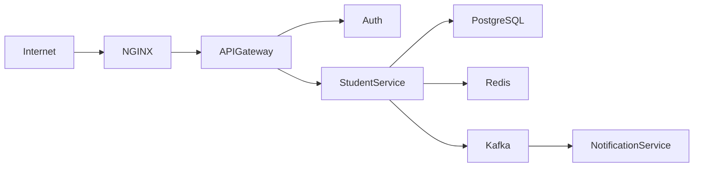

# results_api_application

A great next step is to design and implement a production-style project, for example:

Deploy it using:

Docker
Kubernetes
Redis
Kafka
PostgreSQL
Spring Security + JWT
Prometheus + Grafana (optional)

Building this end-to-end will reinforce the concepts you've learned much more effectively than reading additional theory.

After completing that project, you can return to advanced topics like CAP theorem, database scaling, and high availability with much stronger intuition.
